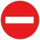

1\. **SOBANURA AMAGAMBO AKURIKIRA :**

1. **_Inzira nyabagendwa.Ing.2_**

R/Ni imbago zose z’imihanda minini, amabarabara, aho abantu

nyamwinshi bahurira, aho imodoka nyinshi zihagarara, inzira n’utuyira two ku muhanda, ibiraro, ibyombo, muri rusange imihanda nyabagendwa igendwamo ku butaka.

1. **\*Umuhanda**.\*

Ni igice cy’inzira nyabagerwa kinyurwamo n’ibinyabiziga ikaba yagira

imihanda myinshi.

1. _Inzira y’ibinyabiziga._

Ni umuhanda n’inzira ziwukikije.

1. _Igisate cy’umuhanda._

Kimwe mu bisate bigabanyije umuhanda mu burebure bwawo.

1. _Agahanda k’amagare._

Igice cy’inzira nyabagerwa cyahariwe amagare na velomoteri kigaragazwa n’ikimenyetso cyabigenewe.

1. _Isangano._

Ahantu hose imihanda ihurira

1. _Inkomane._

Aho umuhanda wisukira mu wundi.

1. _Akayira._

Inzira ifunganye yagenewe abanyamaguru, ibinyabiziga by’ibiziga

bibiri.

1. _Inzira y’igitaka._

Inzira nyabagerwa yagutse ariko itanyurwamo n’ibiziga bibiri.

1. _Urusisiro._

Ahantu hari amazu yegeranye cg afatanye.

1. _Umuyobozi._

Ni umuntu wese utwaye ikinyabiziga cg uyobora mu nzira nyabagerwa inyamaswa cg amatungo.

1. _Umukozi ubifitiye ububasha._

Umukozi wambaye mu buryo bugarara imyenda iranga imirimo ashinzwe.
` `**PAGE** 10 **|** P a g e P r e p a r e d b y R U K U N D O F a u s t i n

1. _Ikinyabiziga._

Igikoresho cyose gikoreshwa mu gutwara ibintu n’abantu ku butaka, igihingishwa, gikoreshwa mu nganda n’ahandi.

1. _Ikinyamitende._

Ikinyabiziga cyose kigendeshwa n’ingufu z’abantu nk’igare,…

1. _Igare._

Ikinyamitende cyose cy’ibiziga bibiri

1. _Velomoteri._

Ikinyabiziga gifite ibiziga bibiri kandi gifite moteri itarengeje imbaraga

za KvA 4 n’umuvuduko ntarengwa ukaba 60km/h

1. _Ipikipiki._

Ikinyabiziga cyose cy’ibiziga bibiri gifite moteri ukuyemo za

velomoteri.

1. _Ikinyamitende itatu cg ine._

Ibinyabiziga bifite moteri itarengeje KvA15

1. _Ikinyabiziga kigendeshwa na moteri._

Ikinyabiziga cyose gifite moteri kandi kigendeshwa gusa n’ibikigize.

1. _Imodoka._

Ikinyabiziga cyose kigendeshwa na moteri uretse za velomoteri, amapikipiki, imashini zihinga cg zikurura izindi.

1. _Romoroki._

Ikinyabiziga cyose cyagenewe gukururwa.

1. _Makuzungu._

R/ Ni romoroki iyo ariyo yose ifatishwa ku kinyabiziga gikurura.

1. _Romoroki ntoya._

R/ Romoroki ifite ibiro bitarenga 750

1. _Ibinyabiziga bikomatanye cg ibinyabiziga bikururana._

R/ Ibinyabiziga bikomatanye bigenda nkaho ari kimwe.

1. _Ikinyabiziga gifanije._

R/ Ni ikinyabiziga gikomatanye kimwe ari ikinyabiziga ikindi ari makuzungu

1. _Ikinyabiziga gikururana kabiri._

R/ Ikinyabiziga gifatanije n’ikindi ari makuzungu.

1. _Uburemere bwite_

R/ Uburemere bw’ikidapakiye.

1. _Uburemere bwikorewe_

R/ Uburemere bwite hongewemo uburemere bw’imizigo.

1. _Uburemere ntaregwa bwemewe_

R/Uburemere bugendanwa.

1. _Guhagarara umwanya munini_

R/ Igihe kiruta igihe ikinyabiziga giharara hinjiramo abantu cg ibintu.

1. _Guhagarara umwanya muto._

R/Igihe ikinyabiziga giharara kugira ngo abantu bajyemo cg ibintu bijyemo.

1. _Akagarura rumuri. Ing.2(30)_

R/ Akantu karabagirana gasubiza urumuri ku kirwohereje.

1. _Ikinyabiziga ndakumirwa_

R/ Ibinyabiziga by’abapolisi, Ibizimya inkongi, Ibitwara abarwayi, aho bijya bigiye gutabara birangwa n’intabaza irabagira cg irangurura amajwi.

1. _Amatara y’urugendo. Ing.2(32)_

R/Amatara y’ikinyabiziga amurika imbere mu muhanda mu ntera

ndende

1. _Amatara yo kubisikana .Ing.2(33)_

R/ Amatara y’ikinyabiziga amurika inzira nyabagerwa atagobye guhuma ibinyabiziga bituruka imbere.

1. _Amatara ndangambere. Ing2(34)_

R/ Amatara y’ikinyabiziga akiranga kandi agaragaza ubugari bwacyo

burebewe imbere.

1. _Amatara ndanganyuma. Ing.2(35)_

R/ Amatara y’ikinyabiziga akiranga kandi agaragaza ubugari bwacyo burebewe inyuma.

1. _Amatara kamena-bihu y’imbere.Ing.2(36)_

R/ Amatara y’ikinyabiziga abonesha neza imbere yacyo mu gihe cy’igihu, cy’imvura nyinshi, cy’urubura cg cy’umukungugu.

1. _Amatara kamena-bihu y’inyuma.Ing.2(37)_

R/ Amatara y’ikinyabiziga akiranga kandi yerekana ubugari bwacyo uburebeye inyuma, mu gihe cy’ibihu, cy’urubura cg mu bihe by’umukungugu.

1. _Amatara yo kubisikana..Ing.2(33)_

R/ Amatara magufi.

1. _Amatara yo gusubira inyuma.Ing.2(38)_

R/ Amatara abonesha inzira inyuma y’ikinyabiziga, akereka n’abandi ko

icyo kinyabiziga kiri gusubira inyuma.

1. _Itara ndangacyerekezo. Ing.2(39)_

R/ Cg ikinnyoteri, Itara ry’ikinyabiziga ryereka abandi bagenzi ko

ikinyabiziga gishaka gukata.

1. _Itara rishakisha. Ing.2(40)_

R/ Itara rihindukizwa rishobora kureba ikintu kiri no mu mpande zacyo.

1. _Itara ndangamubyimba. Ing.2(41)_

R/ Itara ndangaburumbarare, itara ry’ikinyabiziga ryerekana ubugari bw’ikinyabiziga haba inyuma cg imbere.

1. _Ubuso bubonesha. Ing.2(42)_

R/ Ubuso busohokana urumuri, cg ubuso burabagiranamo urumuri ku tugarurarumuri.

1. _Itara ry’umuhondo. Ing.2(43)_

R/ Umuhondo wiganje, cg usa n’icunga rihishije cg umuhondo wiganje.

1. _Ukuboko kuzamuye k’umukozi ubifitiye ububasha kuvuga iki ?_

R/ Kuvuga ko umugenzi wese agomba guhagarara keretse uwageze mu masangano ugomba guhita ahava.

1. _Ukuboko cg amaboko atambitse ategeka iki ?Ing.5(2b)_

R/ Hategekwa guhagarara abaturuka mu cyerekezo gisanganya amaboko arambuye.

1. _Kuzunguza intambike itara ritukura bivuga iki ?_

R/ Hahagarara abo iryo tara rireba.

**B.**

1. _Vuga batanu mu bakozi babifitiye ububasha.Ing.3_

R/ Ba ofosiye na ba suzofiye bo muri polisi y’igihugu bari mu kazi. Ba kaporali na abapolisi bo muri Polisi y’igihugu igihe bari mu kazi.

Abapolisi bo mu mutwe ushinzwe umutekano mu muhanda.

Abakozi bo mu biro by’amateme.

Abakozi ba gasutamo.

Abakozi bo mu biro by’imisoro.

Abakozi b’ikigo cy’ubucyerarugendo.

Abakozi bo mu biro bya Ministeri ishinzwe gutwara ibintu n’ibintu babiherewe uburenganzira na Ministiri w’ubutabera.

1. _Vuga ibintu bitanu umugenzi wese uguweho n’impanuka asabwa_

_?Ing.4_

R/ Guhita ahagarara niba bishoboka.

Gukora uko ashoboye kugirango badahungabanya uburyo bwo kugendera mu muhanda.

Kwirinda guhindura ibimenyetso,

Kumenyesha no gutumaho abubahiriza amahoro bari hafi aho.

1. _Ni ryari umuyobozi wese ategetswe kugaragaza umwirondoro we_

_? Ing.4(4)_

R/ Iyo abandi bantu bahuye n’impanuka babimusabye.

1. _Ni ryari umuyobozi agomba guhita akuraho ikinyabiziga cye gihagaze umwanya munini cg muto ?_

   R/Ni igihe abisabwe n’umukozi ubifitiye ububasha.

1. _Ni ryari umugenzi wese agomba kubahiriza ibimenyetso byashyiriweho gutunganya uburyo bwo kugenda mu muhanda ?Ing.5(5)_ R/ Igihe bitunganijwe neza kandi bigaragara bihagije.
1. _Ibitegekwa birusha ibindi gukomera ni ibihe ?Ing.5(6)_

R/ Ni ibitegekwa n’abakozi babifitiye ubushobozi.

1. _Vuga ikintu utagomba kwibagirwa igihe ugiye gutwara ikinyabiziga kigendeshwa na moteri?Ing.6(1)_

   R/ Ni uruhushya rwo gutwara icyo kinyabiziga.

2. _Sobanura kandi uvuge abagomba impushya zikurikira :Ing.6(2)_
3. _Urwego A_ : Amapikipiki n’ibinyamitende itatu biriho cg bidafite

intebe ku ruhande. Imyaka 18

1. _Urwego B_ : Imodoka zagenewe gutwara abantu kandi zifite imyanya

8 ntarengwa habariwemo n’uw’umuyobozi. Imyaka 18

Imodoka zagenewe gutwara ibintu zifite uburemere ntarengwa bwa toni 5.

Ibinyamitende ine bifite moteri.Imyaka 18

1. _Urwego C_: Imodoka zagenewe gutwara ibintu bifite uburemere bwemewe burenga toni 5.Imyaka 20
1. _Urwego D_: Imodoka zagenewe gutwara abantu kandi zifite imyanya

irenga 8 hatabariwemo umwanya w’umuyobozi. Imyaka 20

1. _Urwego E._ Ibinyabiziga bikomatanye bifite ikinyabiziga gikurura kiri mu rwego rwa B, C, D. Imyaka 20
1. _Urwego F_: Ibinyabiziga bidasanzwe (imashini zihinga, ...) Imyaka 18
1. _Izindi modoka zitaboneka muri izi nzego zibarirwa mu ruhe rwego ?_

R/ Ni mu rwego rwa B.Ing.6 (3)

56. _Ni ryari uruhushya rw’ibinyabiziga rutangwa burundu ?Ing.6(4)_ R/ Ni igihe ubazwa azi amategeko y’umuhanda n’igihe ubazwa azi bihagije gutwara ikinyabiziga cyo mu rwego asabira uruhushya rwo gutwara.
57. _Uruhushya rw’agateganyo rufite agaciro ku zihe nzego ?_

R/ Rufite agaciro ku nzego zose.

56. _Ni ryari ufite uruhushya rw’agateganyo ashobora gutwara_

_ikinyabiziga ?_

R/ Ni igihe ari kumwe n’umuyobozi ufite uruhushya rwo gutwara icyo kinyabiziga.

56. _Vuga ikintu kiranga ikinyabiziga kigirwaho._

R/ kirangwa n’inyuguti ya L yanditswe mu ibara ry’ubururu kandi n’uburebure butari hasi ya 15cm. Cg icyapa cy’umweru cyanditsweho « Auto-Ecole ».

56. _Iyo uruhushya rwo gutwara ikinyabiziga rutakaye rusimburwa n’iki_

_?Ing.6(6)_

R/ Rusimburwa n’inyandiko yarwo mu minsi itarenga 15.

56. _Uruhushya rwo gutwara ibinyabiziga rwimwa cg rwamburwa nde ?_

R/ Abantu barwaye amaso ku buryo bitakosorwa n’indorerwamo. Abantu batumva n’izindi ndwara zabuza ingingo gukora neza.Ing.6(8)

56. _Iyo rwambuwe rwamburwa na nde kandi bigenda gute ?_

R/ Rwamburwa na Prokireri wa Repubulika abonye icyemezo cya muganga wa Leta.Ing.6(8)

56. _Ni bande batagomba kugendana impushya zatangiwe mu Rwanda?Ing.6(9)_

    R/ Abantu bataramara umwaka mu Rwanda ariko bafite uruhushya mva mahanga rwemewe.

57. _Vuga ibintu bitanu bishobora kubangamira uburyo kugendera mu muhanda.Ing.8_

    R/ Kujugunya, kurunda, gusiga cg kugusha ibintu ibyo aribyo byose, nk’ibisate by’ibirahure, mazutu, lisansi, gazi, n’amavuta, kuka ibyotsi cg ikindi kintu cy’inkomyi.

58. _Uku kubangamira umuhanda byemerewe nde kandi ryari?_

R/ Byemerewe ku bakozi b’imirimo ya Leta cg se abandi bantu bikorera

babiherwe uruhushya.

56. _Ni iki umuyobozi agomba gukora igihe aguweho n’impanuka?_

_Ing.8(2)_

R/ Guhita atunganya umuhanda kugira ngo arinde impanuka ishobora

guterwa na we yabinanirwa bigakorwa n’umuherekeje.

56. _Iyo umuyobozi atabishoboye bikorwa nande?_

R/ Bikorwa n’umuherekeje.

56. _Vuga ibintu bitanu byonona inzira nyabagerwa?Ing.8(3)_

R/ Kuvanaho, kwimura, guhirika cg gusenya imbago, ibimenyetso cg ibyapa biyiteyeho cg biyubatseho.

56. _Umuyobozi agomba gukora iki kugira ngo atangiza umuhanda?_

R/ Kugabanya ibitwawe cg kunyura undi muhanda.

56. _Umuyobozi ufite imyaka ikurikira yemerewe iki?_
1. _Imyaka 20_: Urwego rwa C,D,E,F
1. _Imyaka 18_: Amapikipiki n’ibinyamitende itatu bifite moteri.A,B
1. _Imyaka 15_: Velomoteri.
1. _Imyaka 14_:Inyamaswa zikurura cg zigerwaho.
1. _Imyaka 12_:Abayobozi b’amatungo.
1. _Ni uruhe ruhande rugomba kugendwamo mu muhanda? Ni ryari_

_agomba kwegera inkombe y’iburyo?_

R/ Ni uruhande rw’iburyo. Agomba kwegera cyane uruhande rw’iburyo igihe agiye guhura n’undi cg undi agiye kumunyuraho.

56. _Inyamaswa zigenda mu muhanda zigendeshwa ku yihe nkombe?_

R/ Zigendeshwa ku nkombe y’uruhande rw’iburyo.

56. _Ku muhanda ugabanyijemo ibisate bine bigendwamo gute?_

R/ Umuyobozi agomba kugenda muri kimwe mu bisate bibiri by’iburyo.

56. _Ni ryari byemewe kugenda ku mirongo ibangikanye?_

R/ Igihe umuhanda ugendwamo mu cyerekezo kimwe.

56. _Umuyobozi ugenda mu muhanda abujijwe kurengera iki?Ing.13(1)_

R/ Kurengera inzira y’abanyamaguru.

56. _Ni ikihe kinyabiziga kibujijwe gukomeza kugenzwa mu muhanda?_ Ing.13(2)

    R/ Igihe ikinyabiziga kirengeje metero 4 z’ubuhagarike habariwemo n’ibyikorewe.

57. _Hasigwa ubugari bungana iki iyo umuyobozi anyuze ku nkomyi?Ing.14_

    R/ Hasigwa metero imwe.

58. _Iyo bidashobotse umuyobozi agendera ku wuhe muvuduko?_

R/ 5km/h

56. _Umuyobozi wese ugiye kugera mu nkomane akora iki?_

R/ Agomba kugabanya umuvuduko byaba ngombwa akerekana

ikimenyetso cy’uko ahageze.

56. _Umuyobozi wese uvuye mu nzira nyabagerwa ifite ibyerekezo bibiri akaba ashaka kwinjira mu yindi ategetswe iki? Ing.15(2)_

    R/ Areka ibindi biyigendamo bigatambuka.

57. _Umuyobozi wese uvuye mu muhanda utarimo kaburimbo ategetswe iki?_

    R/ Ategetswe kureka abagenda mu muhanda urimo kaburimbo bagatambuka.

58. _Umuyobozi wese uvuye mu kayira cg mu nzira y’igitaka ategetswe_

_iki?_

R/ Ategetswe kureka abandi bagatambuka.

56. _Umuyobozi wese uvuye ahantu hahana imbibi n’inzira nyabagerwa_

_ategetswe iki?_

R/ Ategetswe kureka abayigendamo bagatambuka.

56. _Umuyobozi ategetswe kureka binyabiziga bituruka mu kuhe kuboko gutambuka?Ing.16_

    R/ Mu kuboko kw’iburyo.

57. _Amategeko yo gutambuka mbere yerekanwa n’ibihe byapa?_

R/ Ibimenyetso by’amatara n’ibindi byapa B1, B2b na A22

56. _Umuyobozi ugiye kugera mu masangano aho agomba kuzenguruka asabwa iki?Ing.16(2)_

    R/ Asabwa kureka abayigezemo bakabanza bakavamo.

57. _Umuyobozi wese ugeze mu masangano aho ibinyabiziga biyoborwa_

_n’ibimenyetso by’umuriro asabwa iki?_

R/ Agomba guhita avamo adategereje ko yemererwa ntawe abangamiye.

56. _Umuyobozi wese ushaka kugira aho agana asabwa iki?Ing.17_

R/ Asabwa kubanza kumenya ko ntawe ari bubere inkomyi.

56. _Mbere yo gukata cg kujya ku ruhande rw’umuhanda umuyobozi_

_asabwa iki?Ing.17_

R/ Agomba mbere y’igihe kubigaragaza akoresheje amatara ndanga

cyerekezo cg agakoresha ukuboko.

56. _Ni ryari ikimenyetso cyatanzwe kirekeraho gutangwa?_

R/ Iyo imiyoborere irangiye.

56. _Abayobozi b’ibindi binyabiziga basabwa iki igihe bahuye_

_n’ibinyabiziga bitwarira abantu hamwe?Ing.18_

R/ Kugenda buhoro, byaba ngombwa bagahagarara akanya gato.

56. _Kubisikana bikorerwa he? Ing.20_

R/ Bikorerwa iburyo.

56. _Umuyobozi wese ubisikana n’undi asabwa iki? Ing.20(2)_

R/ Asabwa gusiga umwanya uhagije ibumoso bwe.

56. _Iyo ubugari bw’umuhanda budahagije ibisikanwa rikorwa_

_rite?Ing.2(3)_

R/ Abayobozi basabwa koroherana.

56. _Iyo umuhanda ucuramye cyane, aho ibisikana ridashoboka cg riruhije, bigenda bite?Ing.20(5)_

    R/ Umuyobozi w’ikinyabiziga kimanuka ashyira ku ruhande ikinyabiziga cye, Iyo hagomba kugira abasubira inyuma, ni abatwaye ibinyabiziga bidakomatanye basubira inyuma, cg abatwaye ibinyabiziga bitwaye ibintu bihuye n’ibitwarira abantu hamwe.

57. _Ni abahe bayobozi bagomba guhagarara? Ni abahe bayobozi bagomba gusubira inyuma?Idem Q.97_
58. _Kunyuranaho bikorerwa mu ruhe ruhande?Ing.21_

R/ Bikorerwa mu ruhande rw’ibumoso.

56. _Ni ryari kunyuranaho bishobora gukorerwa iburyo?Ing.21_
57. _Vuga ibintu bine umuyobozi agomba kwiringira mbere yo kunyura ku wundi?Ing21(2)_

    R/ Agomba kwiringira:

    Ko uwagiye kunyuraho na we atatangiye kunyura ku wundi cg atagiye gukatira ibumoso,

    Ko nta wundi muyobozi watangiye kumunyuraho,

    Ko igisate cy’umuhanda agiye kunyuramo kitarimo inkomyi,

    Ko ashobora kugaruka mu muhanda atabangamiye mugenzi we, Kandi agomba kwerekana igikorwa agiye gukora.

58. _Umuyobozi ushaka kunyuranaho asiga intera ingana iki yitaza mugenzi we?Ing.21(3)_

    R/ Agomba gusiga umwanya uhagije ntujye munsi ya 50cm na 1m igihe agiye kunyura ku banyamaguru cg ku nyamaswa.

59. _Umuyobozi wese ugenda mu muhanda ashaka kunyuranaho igihe ubugari bwawo budahagije ashobora kunyura he? Ing.21(6)_

    R/ Ashobora kunyura mu nzira y’abanyamaguru amaze kwiringira ko

    ntawe ari buteze inkomyi.

60. _Umuyobozi ubonye ko hari undi ushaka kumunyuraho asabwa iki?Ing.21(6)_

    R/ Yegera ku buryo bushoboka bwose kwegera inkombe y’iburyo kandi akagabanya n’umuvuduko.

61. _Ni ryari umuyobozi asabwa kugenda buhoro byaba ngombwa agahagarara? Ing.21(6)_

    R/ Iyo hari undi uri kumunyuraho kandi umuhanda ari muto anamurusha umuvuduko.

62. _Umuyobozi ufite ikinyabiziga kirenga m 8 asabwa iki iyo abonye ko hari undi ugiye kumunyuraho?Ing.21(6)_

    R/ Agomba kwerekana ko yabonye ko ugiye kumunyuraho.

63. _Umuyobozi w’ikinyabiziga cyari gihageze asabwa iki mbere yo kongera kugenda?_

    R/ Arabanza akareka ibinyabiziga bigiye kumunyuraho bigahita cg ibigiye guhura nabyo bigahita.

64. _Ni ryari kunyuranaho ibumoso bibujijwe?Ing.22(2)_

R/ Iyo uwo ugiye kunyuraho yerekanye ko agiye gukatira ibumoso.

56. _Kunyura ku binyabiziga bindi uretse icy’ibiziga bibiri bibujijwe_

_ahantu hari ikihe cyapa?_

R/ Dessin C13a

56. _Ni ryari umuhanda ushobora kugirwa icyerekezo kimwe?Ing.23(1)_

R/ Igihe bifuza kongera umutekano mu muhanda.

56. _Icyerekezo kimwe gishyirwaho nande?_

R/ Umukuru w’intara, haba ari mu gihugu cyose bigakorwa na Ministiri

ushinzwe imirimo ya Leta.

56. _Umuyobozi wese ushaka gukata , kuva mu muhanda cg guhagarika ikinyabiziga cye ibumoso ategetswe iki?Ing.23(1)_

    R/ Agomba kugaragaza icyo ashaka gukora mbere.

57. _Iyo akatira iburyo abigenza ate Ing.23(1a)_

R/ Iyo ashaka gukatira iburyo yegera uko bishobotse kose iburyo bw’umuhanda kandi akagabanya umuvuduko, kandi na none ashobora kwegera ibumoso igihe abonye aribyo byamworohera ariko abonye ko ntawatangiye kumunyuraho.

56. _Iyo akatira ibumoso abigenza ate?Ing.23(1b)_

R/ Yegera uko bishobotse kose umurongo ugabanya umuhanda mo ibice bibiri mu burebure ariko atawugiye hejuru, kandi akagabanya umuvuduko, iyo ari umuhanda ufite icyerekezo kimwe yegera ibumoso.

56. _Mu guhindura icyerekezo umuyobozi asabwa ibiki? Asabwa kureka hagahita bande?Ing.23(3)_

    R/ Agomba kubigira abanje kugabanya umuvuduko.

    Kandi agomba kureka ibinyabiziga n’abanyamaguru bari mu muhanda avuyemo bagahita. Nanone kandi areka abanyamaguru bashaka kwambuka bakabanza bakambuka yaba ari mu muhanda avuyemo cg uwajyamo.

57. _Umuvuduko w’ikinyabiziga uringanizwa hakurikijwe iki?Ing.26_ R/ Biterwa n’uko ahantu hameze, imimerere y’ikirere, imimerere y’ikinyabiziga cg ibyo kikoreye ndetse n’ubwinshi bw’ibigendera mu muhanda.
58. _Gukacira feri cg kugabanya umuvuduko mu buryo budasanzwe byakwagiza iki?Ing.26(2)_

    R/ Bishobora kubangamira imigendere isanzwe y’ibindi binyabiziga.

59. _Abayobozi b’ibinyabiziga bifite moteri bageze hafi y’amatungo,_

_inyamaswa zikorera cg zigenderwaho basabwa iki?Ing.28_

R/ Basabwa kugenda buhoro, bakitaza byaba ngombwa bagahagarara.

56. _Erekana umuvuduko wa ngombwa ku bintu bikurikira:Ing.29_
1. _Amapikipiki n’imodoka zifite uburemere ntarengwa 350kg_

R/ Umuvuduko wa 80km/h

1. _Amavatiri y’ifasi cg amatagisi uburemere ntarengwa 3500._

R/ Umuvuduko wa 70km/h

1. _Imodoka zifite uburemere ntarengwa bwa 12500 n’ibitwarira abantu_

_hamwe._

R/ Umuvuduko wa 60km/h

1. _Ibinyabiziga by’ubuhinzi._

R/ Umuvuduko wa 25km/h

Iyo ari ibinyabiziga bikomatanye ni 50km/h

56. _Erekana umuvuduko wo mu nsisiro ku modoka zagenewe gutwara abantu._

    R/Imodoka zidashobora kurenza toni 5 n’izitwarira abantu hamwe ni

    umuvuduko wa 50km/h.

57. _Ibindi binyabiziga byose.Ing.29_

R/ Ibindi ni 40km/h.

56. _Imizigo y’ikinyabiziga igomba gupangwa hakurikijwe iki? Ing.60_ R/ Ku buryo idashobora kubangamira uburyo bwo kugendera mu muhanda busanzwe. Kubuza kubona neza imbere umuyobozi cg inyuma, gukingiriza amatara cg ibimenyetso by’ikinyabiziga.
57. _Ikinyabiziga cyose gifite uburemere ntarengwa bwemewe burenga toni 5 kigomba gushyirwaho iki?Ing.29(4)_

    R/ Bashyiraho icyapa cyerekana umuvuduko ntarengwa w’icyo

    kinyabiziga.

58. _Icyapa gishyirwa ku kinyabiziga kirengeje toni 5 gishyirwa he kandi kiba kumeze gite?Ing.29(5)_

    R/ Icyo cyapa kigomba gushyirwa inyuma mu ruhande rw’iburyo, kigira

    ubugari bwa 21cm kandi umuzenguruko ugomba kuba utukura.

59. _Ku binyabiziga by’ingabo z’igihugu ikimenyetso kiranga_

_umuvuduko gishyirwa he?Ing.29(6)_

Gishyirwa inyuma ku ruhande rw’iburyo kimwe n’ikimaze kuvugwa.

56. _Ni iyihe Ministeri ishinzwe gushyiraho imivuduko ntarengwa?Ing.30_

    R/ Ni Ministeri ishinzwe imirimo ya Leta.

57. _Ni umwanya ungana iki usigwa hagati y’ibinyabiziga_

_bikurikiranye? Kuki? Ing.31_

R/ Ni intera yitaje kandi ihagije.

56. _Ku binyabiziga bikomatanye basiga umwanya ungana iki? Kuki?_

R/ Agomba gusiga umwanya uhagije keretse igihe agiye kukinyuraho.

56. _Ni ryari gusiga umwanya uhagije hagati y’ibinyabiziga_

_bikurikiranye atari ngombwa? Ing.31(3)_

R/ Ni igihe kunyuranaho bibujijwe cg se igihe mu muhanda harimo ibinyabiziga byinshi.

56. _Ikinyabiziga cg inyamaswa bihagaze umwanya muto cg munini biba biri mu ruhe ruhande? Ing.32_

    R/ bigomba kuba biri mu ruhande rw’iburyo cg se bikaba ibumoso igihe umuhanda ufite icyerekezo kimwe.

57. _Ni ryari bishobora kuba mu rundi ruhande?_

R/ Ni igihe umuhanda ufite icyerekezo kimwe.

56. _Ibinyabiziga bihagaze mu muhanda umwanya muto bihagarara bite? Kandi hehe?Ing.32(2)_

    R/ Bigomba gutonda umurongo bikurikiranye ku nkombe y’umuhanda.

57. _Igihe ntarengwa cyo guhagarika ikinyabiziga mu nzira nyabagerwa kingana iki?Ing.32(3)_

    R/ Ni iminsi 7.

58. _Ni iki umuyobozi agomba kwiringira mbere yo gusiga ikinyabiziga cye cg inyamaswa ze?Ing.32(4)_

    R/ Agomba kwiringira ko icyo kinyabiziga cye kitaza guteza impanuka

    kandi akiringira ko kitaza gukoreshwa n’undi.

59. _Mbere yo gukingura umuryango w’ikinyabiziga, kuva cg kujya mu_

_kinyabiziga ugomba kwiringira iki?Ing.32(5)_

R/ Kwiringira ko utaza kubera imbogamizi abandi bagenzi bari mu nzira nyabagerwa.

56. _Ni bihe binyabiziga bitari ngombwa kurangwa n’ikimenyetso igihe_

_bihagaritswe mu muhanda?Ing.32(6)_

R/ Ni velomoteri cg ipikipiki idafite akanyabiziga ku ruhande.

56. _Icyo kimenyetso kiba kiri he?Ing.32(6)_

R/ Icyo kimenyetso kiba kiri ahantu hagaragarira buri wese.

56. _Ni ryari biba ngombwa gushyira ku kinyabiziga ikimenyetso kikiranga igihe gihagaritswe mu muhanda? Ing.32(6)_

    R/ Iyo abayobozi bakigana badashobora gupfa kumenya ko kibabereye imbogamizi. Cg se ari ahantu habujijwe guhagarara.

57. _Umwanya usigara hagati y’ibinyabiziga bibiri bihagaze umwanya munini ku ruhande rumwe rw’umuhanda ugomba kuba ungana ute mu nsisiro? Ahatari mu nsisiro?Ing.32(7)_

    R/ ni 5m mu nsisiro na 20m ahatari mu nsisiro.

58. _Vuga ahantu hatanu bibujijwe guhagarara umwanya muto cg munini.Ing.33_

    R/ Ku iteme, mu ikoni, ahari ibimenyetso bibibuzanya, munsi

    y’amateme, mu mpinga, mu muhanda ufite ubugari buto, hafi cyane

    y’ibimenyetso by’umuriro 2m, mu nzira z’abanyamaguru, mu ruhande

    ruteganye n’urwo ikindi kinyabiziga gihagazemo, mu nsisiro,...

59. _Vuga ahantu hatanu ikinyabiziga kibujijwe guhagarara akanya kanini. Ing.33(3)_

    R/ Ahantu hinjirwa n’ahasohokerwa n’abantu benshi, Imbere y’amashuri cg ahagenewe imyidagaduro,

    Hafi yaho binjirira mu duhanda tujya mu bibanza byatikanye n’uwo

    muhanda,

    Ahantu abanyamaguru banyura ngo bakikire inkomyi, Ahantu habuza uko bagera ahateganyijwe guhararamo,

    Ahatagejeje muri 1m y’ikinyabiziga gihagaze umwanya muto cg munini, Ahatagejeje muri 15m y’ikimenyetso kerekana aho ibinyabiziga bitwarira abantu hamwe bihagarara.

    Mu muhanda urimo umurongo udacagaguye,

    Mu muhanda wo hagati mu nzira igabanijwemo ibisate bitatu,...

60. _Erekana icyapa kigaragaza ahantu umuntu atagomba guhagarara akanya . Ing.34_

    R/ Dessin C20a cg C20b

61. _Iyo umuyobozi w’ikinyabiziga adahari ikinyabiziga gikurwaho_

_nande? Ibyangiritse birihwa nande? Ing.35_

R/ Gikurwaho n’umukozi ubifitiye ububashaibyangirite bikarihwa na

Leta, ariko cyaba cyari gihagaze nabi bikarihwa na nyiracyo..

56. _Amatara y’intabaza agira irihe bara? Ayo matara y’intabaza_

_akoreshwa ryari?Ing.Ing.36(1)_

R/ Ibara ry’ubururu, agakoreshwa igihe ikinyabiziga kiri mu butumwa

bwihutirwa.

56. _Intabaza ndangurura majwi ikoreshwa gusa ryari? Ing.36_

R/ Ikoreshwa gusa igihe ikinyabiziga kiri mu butumwa bwihutirwa.

56. _Iyo umugenzi ari mu nzira nyabagerwa asatiriwe n’ikinyabiziga_

_ndakumirwa akora iki? Ing.37_

R/Agomba kugihigamira byaba na ngombwa agahagarara.

56. _Ni ayahe mategeko ibinyabiziga ndakumirwa bisabwa kubahiriza?Ing.37_

    R/ Abakozi babifitiye ububasha, Ibyapa biyobora (byerakana)n’

    Ibiburira)

57. _Ni ibihe bimenyetso ibinyabiziga ndakumirwa bisabwa byanze bikunze kubahiriza?_

    R/ Ibyapa biburira n’ibyapa biyobora.

58. _Imirongo yose y’ingabo n’agatsiko kose k’abanyamaguru bari mu_

_muhanda bategetswe kugendera mu ruhe ruhande?Ing.38(1)_

R/ Mu ruhande rw’iburyo.

56. _Abagendera mu nzira nyabagerwa babujijwe kwata ibiki? Ing.38(2)_

    R/ Umurongo w’abanyeshuri bashorewe na mwarimu, Umurongo w’abasirikare,

    Uruhererekane,

57. _Ni izihe nkomyi zidakurikizwa ku binyabiziga ndakumirwa?_

R/ Imirongo imaze kuvugwa hejuru ku kibazo cya 151.

56. _Abashaka gusiganwa mu nzira nyabagerwa basabwa iki?Ing.39_

R/ Kwishingira ibyakwangirika byose

56. _Uruhushya rw’amasiganwa rusabwa nde iyo amasiganwa abera mu karere kamwa? Mu ntara? Mu gihugu?_

    R/ Umuyobozi w’akarere, Umukuru w’intara. Ministiri ushinzwe ubutegetsi bw’igihugu.

57. _Abahabwa uru ruhushya babanza kuzuza ibiki?Ing.39(3)_

R/ Kugira ubwishingizi bw’ibyakwangirika byose.

56. _Uburemere bwemewe bunyuzwa ku iteme bwerekanirwa hehe?_

_N’iki? Ing.40_

R/ Ubwo buremere bwerekanwa n’icyapa kiba kiri ku ntangiriro y’iryo

teme ku buryo kibonwa neza.

56. _Ni ubuhe buremere bwemewe ku mateme y’ibiti? Ing.40(2)_

R/ Ni toni 8.

56. _Ninde ushobora guhindura uburemere bunyura ku iteme ry’ibiti?_

R/ Ni umukuru w’intara.

56. _Iyo abayobozi begereye ibyome babigenza gute?Ing.40(3)_

R/ Bahagarara ku murongo umwe bashoreranye iburyo bw’umuhanda.

56. _Garagaza uko ibinyabiziga bitambuka mbere bikurikirana.Ing.40(3)_

    R/ Ibitwaye abarwayi, Ibinyabiziga ndakumirwa,

    Ufite icyemezo kimwanditseho cyo guhita mbere, Ibitwaye ubutumwa bwandite bifite ikimenyetso kibiranga, Ibitwaye amatungo.

57. _Ni bande basigara mu kinyabiziga iyo kigiye kwinjira mu cyome?Ing.40(4)_

    R/ Ni umuyobozi n’ugiherekeje.

58. _Iyo imodoka igiye kwinjira mu cyome umuyobozi akora iki?Ing.40(5)_

    R/ Umuyobozi agomba kumanura ibirahure.

59. _Ibyapa byerekana uburemere bw’ibijya mu cyome biba biri he?_

R/ Biba biri ku nkombe y’icyo cyome.

56. _Ku binyabiziga bikurikira erekana uko iyo biri mu nzira nyabagendwa bitagishoboye kugenda uko bigaragazwa biri nko muri metero 200 hatabona neza:Ing.42_
1. _Ibinyamitende, velomoteri n’amapikipiki bidafite akanyabiziga ku_

_ruhande;_

R/ Imbere n’itara rimwe ryera cg ry’umuhondo naho inyuma ni itara

ritukura.

1. _Ibinyabiziga bigendeshwa na moteri bitari velomoteri n’amapikipiki_

_bidafite akanyabiziga ku ruhande;_

R/ Inyuma amatara 2 atukura

1. _Imodoka zikuruwe n’inyamaswa, ingorofani, inyamaswa zitwaye_

_imizigo cg zigendwaho kimwe n’amatungo;_

R/ Imbere itara ryera cg risa n’icunga rihishije, inyuma itara ritukura.

1. _Ibinyabiziga bihinga n’ibindi bikoresho bikoreshwa mu ipatana_

_imirimo;_

R/ Ni amatara yavuzwe haruguru.

1. _Ibindi binyabiziga bitavuzwe;_

R/ Itara rimwe ryera imbere cg se risa n’icunga ihishije mu ruhande rw’ibumoso, inyuma itara ry’umutuku riri ku ruhande rw’ibumoso.

1. _Imirongo y’ingabo z’igihugu zigendera kuri gahunda cg utundi_

_dutsiko tw’abanyamaguru nk’abanyeshuri bayobowe na mwarimu bari ku murongo;_

R/ Imbere ibumoso itara ryera, cg risa n’icunga.

Inyuma itara ritukura ibumoso,

Ku ruhande rw’ibumoso mu burebure burenze 6m ni amatara yera.

1. _Romoroki;_

R/ Itara cg amatara yera imbere, inyuma itara cg amatara y’umutuku.

1. _Ibinyabiziga cg imitwaro bifite ubugari burenga metero 2,50. Ing.42(h)_

   R/ Ni amatara yavuzwe haruguru.

2. _Iyo amatara yo ku muhanda adatuma ikinyabiziga gihagaze umwanya munini kitagaragara neza muri metero 100, umuyobozi akora iki?Ing.42(2)_

   R/ Bakoresha amatara ndanga mbere na ndanganyuma.

3. _Amatara ndangambere na ndanganyuma ashobora gusimburwa n’ayahe matara igihe ibinyabiziga bihagaze umwanya munini mu nsisiro kandi bibangikanye ku ruhande rumwe?Ing.42(3)_

   R/ Amatara yo guhagarara umwanya munini.

4. _Sobanura amoko y’amabara yo ku kibazo cya 165 imbere n’inyuma z’ikinyabiziga._

   R/ Amatara yera imbere cg asa n’umuhondo; inyuma aba atukura.

5. _Hacanwa itara ryo ku ruhe ruhande iyo ikinyabiziga gihagaze ahantu umwanya munini kandi hatabona neza? Ing.42(3)_

   R/ Hacanwa amatara ari hafi y’umurongo ugabanya umuhanda mo kabiri

   mu burebure.

6. _Amatara ya kamenabihu akoreshwa iyo umuntu atabona neza muri metero zingahe?Ing.42(4)_

   R/ Muri 100m.

7. _Amatara magufi n’amatara maremare acanirwa rimwe n’ayahe_

_matara? Acanwa ryari?Ing.43_

R/ Acanirwa rimwe n’amatara ndanga hagati yo kurenga kw’izuba no

kurasa kwaryo.

56. _Amatara magufi cg amaremare azinywa ryari?Ing.43(2)_

R/ Iyo uhagaze yaba umwanya muto cg munini.

56. _Vuga ibihe bitatu amatara maremare agomba kuzinywa.Ing.43(3)_

R/ Igihe ugiye guhura n’undi, Igihe umuhanda umurikiwe hose, Iyo ugiye kubisikana n’undi,

Iyo ikinyabiziga gikurikiye ikindi mu ntambwe zitagera kuri 50m keretse iyo ashaka kukinyuraho nibwo ashobora gucana azimya.

56. _Ni ibihe binyabiziga bigomba guhora bicanye amatara (magufi) igihe cyose no mu buryo bwose igihe bigenda? Ing.43(4)_

    R/ Ni velomoteri n’amapikipiki.

57. _Amatara kamena bihu y’ikinyabiziga akoreshwa gusa ryari?_

_Ing.43(5)_

R/ Igihe hatabona neza nko muri metero 100.

56. _Amatara kamena bihu ashobora gusimbura ayahe matara yandi?Ing.43(5)_

    R/ Amatara yo kubisikana cg amatara y’urugendo.

57. _Amatara yo kubisikana n’amatara y’urugendo acanirwa rimwe n’ayahe matara? Ing.43(6)_

    R/ Acanirwa rimwe n’amatara ndanga.

58. _Amatara yo gusubira inyuma acanwa gusa ryari? Ing.43(7)_

R/ Igihe ikinyabiziga kigiye gusubira inyuma.

56. _Amatara ashakisha acanwa gusa ryari? Ing.43(8)_

R/ Ni igihe ari ngombwa kandi atabangamiye abandi.

56. _Umuyobozi ushaka guhindukiza ikinyabiziga cye cg kukiganisha ku ruhande, abigaragariza muri metero zingana iki?Ing.44_

    R/ Muri metero 50 byibura.

57. _Ushaka kugabanya umuvuduko w’ikinyabiziga akora iki?Ing.45_

R/ Acana amatara abyerekana cg agakoresha ukuboko.

56. _Iyo amatara yo guhagarara atagikora neza umuyobozi akoresha iki?Ing.45_

    R/ Akoresha ukuboko.

57. _Kuvuza amahoni bimara igihe kingana iki?Ing.47_

R/ Bimara umwanya muto ushoboka.

56. _Amahoni akoreshwa gusa ryari? Ing.47_

R/ Akoreshwa gusa ushaka kwirinda impanuka.

56. _Amahoni asimbuzwa iki iyo bwije? Ing.47_

R/ Asimbuzwa gucana uzimya amatara magufi cg usimburanya amatara

magufi n’amatara maremare.

56. _Iyo umuyobozi agiye kunyura ku wundi abyerekana ate? Ing.47_

R/ Akoresha imburira zimurika.

56. _Ahegereye inyamaswa zikurura, izikoreye ibintu cg amatungo_

_umuyobozi akora iki kubijyanye n’amahoni? Ing.47(5)_

R/ Birabujijwe gukoresha amahoni.

56. _Abagenzi bicaye mu myanya irimo imikandara bakora iki?Ing.47bis_

    R/ Bagomba kurumanya neza imikandara.

57. _Utuyira turi ku mpande z’umuhanda n’inkengero zigiye hejuru bihariwe bande? Ing.48(1)_

    R/ Ni abanyamaguru.

58. _Abanyamaguru badahuje gahunda banyura he? Ing.48(2)_

R/ Banyura ibumoso ku nkengero y’umuhanda.

56. _Iyo nta tuyira twabigenewe, abanyamaguru baca he? Kandi gute?_

R/ Bashobora guca mu muhanda ariko bitonze.

56. _Iyo abanyamaguru bagenda nijoro bagenda gute? Ing.48(5)_ R/ Bagenda bakurikiranye ibumoso bw’umuhanda iyo badafitanye gahunda.
57. _Abanyamaguru bagomba kwambukira mu myanya yabugenewe iyo iri muri metero zingahe?Ing.48(6)_

    R/ Iyo iri ahatageze muri 50m.

58. _Iyo ari mu nkomane kandi nta mwanya wateguriwe abanyamaguru, banyura he?_

    R/ Bambukira mu murongo wambukiranya iyo nkomane.

59. _Mbese abanyamaguru bategetswe kubahiriza amategeko atangwa_

_n’abashinzwe umutekano mu muhanda? Ing.48(7)_

R/ Cyane.

56. _Abantu batwaye utunyabiziga tw’abana, tw’abarwayi, utw’ibimuga_

_bubahiriza ayahe mategeko? Ing.47(10)_

R/ Amategeko y’abanyamaguru.

56. _Hagati y’imodoka ziherekeranije mu butumwa hagomba kuba hari_

_umwanya ungana iki? Ing.49(1)_

R/ Ni 30m.

56. _Ni ubuhe burebure ntarengwa bwemewe bw’ibinyabiziga biherekeranije mu butumwa?_ R/ Ni 500m.
57. _Amatsinda y’ibinyabiziga biherekeranije mu butumwa atandukanywa n’intera ingana iki? Ing.49_

    R/ Ni 50m.

58. _Ni ku bihe binyabiziga amategeko agenga ibinyabiziga biherekeranije atubahirizwa?Kandi ryari?Ing.49_

    R/ Ku binyabiziga by’ingabo z’igihugu.

59. _Ikinyabiziga cya mbere mu bihjerekeranije kirangwa n’iki? Icya nyuma cyo kirangwa n’iki?Ing.49(2)_

    R/ Icya mbere ni “Attention Convoi” naho icya nyuma ni “Fin de Convoi”.

60. _Amabwiriza agenga ibinyabiziga bya gisirikare biherekeranije ashyirwaho nande? Ing.49(2)_

    R/ Ni Ministiri w’ingabo z’igihugu.

61. _Ibinyabiziga bikururwa n’inyamaswa bigabanywamo amatsinda_

_afite uburebure bungana iki? Ing.49(3)_

R/ Uburebure butarengeje 500m.

56. _Umubare w’inyamaswa zikurura zikurikiranye ugomba kungana_

_ute? Ungana ute iyo zibangikanye? Ing.51_

R/ Zikurikiranye ntizirenga enye. Zibangikanye ntizirenga eshatu.

56. _Ni ryari umuyobozi akenera umuherekeza? Ing.51(4,5)_

R/ Iyo uburebure burenga 18m cg 12m y’imizigo gusa.

56. _Iyo umuyobozi w’akanyabiziga gasunikwa atarebaneza imbere_

_abigenza ate? Ing.52(1)_

R/ Agomba gukurura ikinyabiziga cye.

56. _Ingorofani zinyuzwa he mu nzira nyabagendwa?Ing.52(2)_

R/ Ku nkengero yegutse.

56. _Vuga ibintu bine abayobozi b’amagare na velomoteri babujijwe_

_gukora igihe babiyoboye? Ing.53 (1)(a)_ R/ Kuyobora badafashe amahembe, Badakandagiye ku birenge,

Bakurura inyamaswa, Bakururwa,

Basunika, bakurura cg batwaye ibyabangamira imiyoborere

y’ikinyabiziga.

Kunyura mu muhanda kandi hari agahanda kabo, Kurenza umuvuduko wa 40km/h

Gukoresha andi mahoni atarayo byagenewe,

No kunyura hagati y’imirongo ibiri y’ibinyabiziga bibangikanye.

56. _Ni ryari abayobozi b’amagare na velomoteri bagenda bashoreranye aho kugenda babangikanye?_

    R/ Iyo nta kinyabiziga bagiye guhura nacyo kandi ari ku manywa.

57. _Ingofero zirinda impanuka zambarwa nabande? Ing.53(3)_

R/ Zambarwa n’umuyobozi n’uhetswe.

56. _Niryari abayobozi b’amagare na velomoteri bubahiriza amategeko_

_y’abanyamaguru? Ing.53(5)_

R/ Iyo basunika ikinyabiziga cyabo ni ukuvuga igihe bayoboye ikinyabiziga batakicayeho.

56. _Ni hehe bibujijwe gukinagiza inyamaswa zikorera cg izo_

_bagenderaho kimwe n’amatungo? Ing.55_

R/ Mu nzira nyabagerwa mu nsisiro.

56. _Ni hehe bibujijwe kubyagiza inyamaswa zikurura, izikorera ibintu cg izi bagendaho?_

    R/ Ni mu nzira nyabagerwa.

57. _Erekana icyapa cy’ahantu hagewe kugendera amatungo. Ing.54(3)_

R/ D7

56. _Erekana icyapa cyemerera gushyiramo abantu mu kinyabiziga. Ing.56 bis_

    R/E19

57. _Ikinyabiziga gihagarara he ugereranije n’icyapa kibimwemerera._

_Ing.56 bis_

R/ Ku ntera itarenga 10m uvuye ku cyapa kibimwemera.

56. _Erekana uburumbarare bw’ikinyabizigaIng.57_
1. _Romoroki ikuruwe n’igare:_ 75cm
1. _Romoroki ikuruwe n’ipikipiki_: 1,25cm
1. _Vuga uburebure bw’ikinyabiziga cg ibinyabiziga bikururana_

_ntarengwa._

R/ Ni 7m

56. _Uburebure bwa makuzungu bugomba kungana iki? Ing.57(2)_

R/ Ni 17,40m

56. _Ubuhagarike bw’ikinyabiziga bugomba kungana iki? Ing.57(3)_

R/ Ni 4,20m

56. _Erekana uko igice kirenga ku biziga kigomba kuba kingana imbere_

_n’inyuma. Ing 57(4)_

R/ Ni 3,50m inyuma na 2,70m imbere.

56. _Ninde utanga uburenganzira ku binyabiziga bifite uburumbarare burenga ubwemewe kugendera mu muhanda? Ing.59_

    R/ Ni Minisriri ushonzwe gutwara ibintu n’abantu.

57. _Imizigo y’ikinyabiziga igomba gupakirwa neza hirindwa ibiki?_

_Byibura ibintu bitatu. Ing.60(1)_

R/ Hirindwa guteza abantu ibyago mu rugendo,

Kwangiza inzira nyabagerwa, impande zayo, ibiyubatsweho... Kubuza umuyobozi kibona neza,

Gukingiriza amatara, utureba nyuma, utugarura rumuri, numero, cg ibimesyetso umuyobozi yerekanisha intoki.

56. _Ni ubuhe burumbarare bw’ikinyabiziga ntarengwa habariwemo n’imizigo haba n’inyamaswa cg romoroki? Ing.61(1)_

    R/ ni 2,50m.

57. _Ni ryari ikinyabiziga gishobora gupakira kugera ku burumbarare bwa metero 2,75.Ing.61(1.a)_

    R/ Ni igihe gipakiye ibinyampeke, ikawa, amakara, ibishara, ibyatsi cg

    ibishami cg ubwatsi bw’amatungo.

58. _Ni ryari uburumbarare bw’ibipakiwe bushobora kugera kuri metero 3?_

    R/ Ni igihe hapakiwe ibimaze kuvugwa haruguru ariko bijyanwa ahatarenga 25km.

59. _Ni ryari ubuhagarike bw’ibitwawe bushobora kurenga metero 4?_

_Ing.61(3)_

R/ Ni igihe byakiwe uruhushya.

56. _Ku mpera y’inyuma y’ikinyabiziga uburebure bw’imizigo_

_ntarengwa bungana iki? Ing.62(1)_

R/ Ni 3m.

56. _Iyo imizigo irenga ku kinyabiziga ho metero 1 babyerekanisha iki nijoro? Ku manywa? Ing.63 Ku buhe buhagarike ntarengwa? Ing.63_ R/ Babyerekanisha agatambaro gatukura ka 50cm z’uruhande.

    Ni ijoro hacanwa itara ritukura cg akagarura rumuri gatukura.Bishyirwa

    ahatarenze 1,55m z’ubuhagarike.

57. _Ubugari ntarengwa bw’imizigo yikorewe n’igare na velomoteri_

_kimwe na romoroki zabyo bungana iki?Ing.64(1)_

R/ Ni 75cm.

56. _Ubugari bw’imizigo yikorewe n’amapikipiki adafite akanyabiziga ndetse na romoroki yazo bungana iki?_

    R/ Ni 1,25m

57. _Ubugari ntarengwa bw’imizigo ku kinyamitende itatu n’ikinyamitende ine bugomba kungana iki?Ing.64(3)_

    R/ 2,50m.

58. _Vuga aho imizigo yikorewe n’amagare na velomoteri n’amapikipiki itagomba kurenga haba inyuma cg imbere. Ing.65_

    R/ Ni 50cm inyuma, imbere ho ntiyarenga impera y’imbere y’ikinyabiziga.

59. _Umwanya w’umuyobozi w’ikinyamitende itatu cg ine bifite moteri_

_ugomba kuba byibura ungana iki? Ing.66 (a)_

R/ Ni 55cm.

56. _Ni ryari abana badafite imyaka 12 bemerewe kwicara mu myanya_

_y’imbere y’ikinyabiziga? Ing.66(3)_

R/ Ni igihe hatarimo indi myanya.

56. _Igare, velomoteri n’amapikipiki bitwara abantu bangana iki?_

_Ing.66(5)_

R/ Bangana n’umubare w’intebe yabyo.

56. _Ni ibihe binyabiziga byemerewe gutwara abantu hejuru muri karisori? Ing.66(6:c)_

    R/ Ni ibinyabiziga by’ingabo z’igihugu, Abapolisi, Abasukura imihanda n’Abazimya umuriro.

57. _Erekana uburemere ntarengwa :Ing.67(a)_
58. Kuri buri mutambiko usanzwe:10t
59. Ku mitambiko ibiri ikurikiranye:16t
60. Ku mitambiko itatu:24toni
61. Ibinyabiziga bifite imitambiko ibiri harimo makuzungu:12t
62. Ibinyabiziga bifite imitambiko itatu hatarimo makuzungu:16t
63. Ibinyabiziga bifatanye bifite imitambiko itatu:12t
64. Ibinyabiziga bifatanye bifite imitambiko ine cg irenga:16t
65. Ibinyabiziga bikururana:20t
66. Ku nziga zihagwa:3,20t
67. Inziga zifite umwuka ariko zidahagwa15t
68. Inziga zidahagwa , izikoze mu byuma cg mu ikawucu:250kg
69. _Erekana icyapa kigaragaza uburemere ntarengwa ku binyabiziga._ Ing.68

    R/ Ni C7

70. _Amasaha ntarengwa yo kugenzura uburemere bw’ibipakiwe ni_

_angahe? Ing.68(3)_

R/ Ni amasaha 2.

56. _Ni uwuhe mubare ntarengwa w’ibinyabiziga ugomba gukururwa n’ikindi kinyabiziga gitwarwa na moteri cg inyamaswa? Ing.70(1)_

    R/ Ni bibiri.

57. _Ipikipiki ifite akanyabiziga ku ruhande ikurura romoki zingahe? Ing.70(1)_

    R/ Nta na kimwe.

58. _Ni ryari washyira mu muhanda ibinyabiziga bikururana birenze bitatu? Ing.70(2)_

    R/ Ni igihe hatanzwe uburenganzira na minisitiri ushinzwe gutwara

    ibintu n’abantu.

59. _Iyo hagati ya romoroki n’ikiyikurura hari metero zirenze eshatu_

_bigenda gute? Ing.71(1)_

R/ Ikibizirikanije kigaragazwa ku manywa n’agatambaro gatukura, Ni ijoro ni amatara asa n’icunga rihishije mu mbavu.

56. _Ninde utanga uruhushya rwo gutwara ibintu birenga ibyateganyijwe? Ing.72(1)_

    R/ Ni Ministiri ushinzwe gutwara abantu n’ibintu.

57. _Uwasabye urwo ruhushya aruhabwa amaze kuzuza ibiki?Ing.72(4)_ R/ Aruhabwa ari uko yemeye kwishyura indishyi cg amafaranga y’ingwate ashobora guturuka ku byakwangirika.
58. _Iyo umuyobozi yarenze ku mategeko yo gupakira akorerwa iki? Ing.73_

    R/ Agomba gupakurura yakwanga agahagarikwa burundu.

59. _Ijambo “Ibiziga by’umutambiko” bivuga iki? Ing.74_

R/ Ni ibiziga biteganye uhereye ku murongo ugabanya ikinyabiziga mo kabiri.

56. _Ijambo “feri y’urugendo” bivuga iki? Ing.74_

R/ Uburyo busanzwe bukoreshwa kugira ngo ikinyabiziga kigende buhoro cg ngo gihagarare.

56. _Ijambo “feri yo guhagarara umwanya munini” bivuga iki?Ing.74_ R/ Ni uburyo busanzwe bukoreshwa kugira ngo ikinyabiziga kigume hamwe.
57. _Ijambo “feri yo gutabara” ivuga iki? Ing.74_

R/ Ni uburyo bukoreshwa kugira ngo ikinyabiziga kigende buhoro cg

gihagarare igihe feri y’urugendo idakora neza.

56. _Ijambo “Romoroki” rikoreshwa ryari? Ing.74(e)_

R/ Ni ibinyabiziga bikururwa n’imodoka.

56. _Vuga amoko ya feri. Ing.74(3)_

R/ Hari feri y’urugendo, feri yo gutabara na feri yo guhagarara umwanya

munini.

56. _Ese Romoroki igomba kugira aya moko yose yaza feri? Ing.74(4)_

R/ Igomba kuyagira.

56. _Iyo Romoroki icitse ihagarikwa n’iki?Ing.74(4.f)_

R/ Feri yayo igomba kuba ikozwe ku buryo yihagarika igihe icitse.

56. _Ni ayahe matara yera cg y’umuhondo agomba kujya_

_inyuma?Ing.75(1)_

R/ Ni amatara yo gusubira inyuma gusa n’aranga icyerekezo.

56. _Amatara y’imbere agira ayahe mabara? Ing.75_

R/ Ibara ry’umweru cg umuhondo.

56. _Amatara y’inyuma agomba kuba afite ayahe mabara?Ing.75_

R/ Ni umutuku cg icunga rihishije.

56. _Ni ayahe matara agomba kurenga abiri ku kinyabiziga? Ing.75(3)_ R/ Ni amatara ndanga mubyimba, ndangaburumbarare, cg ayerekana icyerekezo.
57. _Bigenda gute iyo ikinyabiziga gifite amatara abiri cg arenze abiri_

_y’ubwoko bumwe? Ing.75(4)_

R/ Agomba kugira imbaraga zingana kandi agashyirwa hamwe.

56. _Vuga amabara y’utugarura rumuri tw’ikinyabiziga imbere, inyuma_

_no ku mpanda. Ing.75(5)_

R/ Imbere ni umweru naho inyuma ni umutuku naho mu mbavu ni umuhondo cg icunga rihishije.

56. _Amatara cg utugarura rumuri agomba kuba ateye ku buhe buhagarike uvuye ku butaka? Ing.75(7)_

    R/ Ahatari munsi ya 40cm.

57. _Ni ryari amatara maremare cg amagufi atakira rimwe n’amatara_

_ndanga? Ing.75(8.2)_

R/ Igihe akoreshejwe nk’ ibimenyetso bimurika ho imburira.

56. _Itara ndanga rishyirwa he ku kinyabiziga? Ing.76(a.3)_

R/ Rishyirwa ahegereye inguni y’ibumoso.

56. _Ni ryari itara ryo guhagarara rishyirwa ku kinyabiziga? Ing.76(a.2)_

    R/ Ni igihe ingufu za moteri zirengeje 125cm3.

57. _Amatara maremare n’ayo kubisikana akoreshwa ryari? Ing.76(5)_

R/ Ni igihe ikinyabiziga kidapakiye gishobora kurenza 20km/h.

56. _Ibinyamitende itatu agira amatara ndanga mbere angahe n’ndanga_

_nyuma angahe? Ing.76(6)_

R/ Amatara 2 ndanga mbere n’amatara 2 ndanga nyuma.

56. _Ni ryari hakoreshwa itara ribonesha icyapa kiranga numero_

_z’ikinyabiziga? Ing.76(7)_

R/ Ni igihe icyo kinyabiziga gifite icyo cyapa.

56. _Ni ryari Romoroki igomba kugira amatara nkay’ikiyikurura?_

_Ing.76(8)_

R/ Ni igihe iyo Romoroki itera imbogamizi amatara y’imodoka

iyikurura.

56. _Ni ibihe binyabiziga bigira amatara ndangaburumbarare? Ing.76(8,b)_

    R/ Ni ibinyabiziga bifite ubugari burenga 2,10m.

57. _Itara ry’icyatsi riboneka ku matagisi risobanura iki? Ing.76(2,c)_

R/ Ryerekana ko icyo kinyabiziga kitakodeshejwe.

56. _Itara ry’icyatsi riboneka kuri za romoroki rimaze iki kandi_

_rishyirwa he? Ing.76(2,g)_

R/ Umuyobozi arikoresha ashaka kwerekana ko yabonye ikimenyetso

cy’ushaka kumunyuraho.

56. _Ni ibihe binyabiziga bidashyirwaho amatara yabugenewe? Ing.76(2,h)_

    R/ Ni ibinyabiziga bihinga n’ibindi bikoresho bikoreshwa n’abapataniye

    mirimo.

57. _Za Otobis zigenewe gutwara abanyeshuri zishobora gushyirwaho amatara asa ate? Kuki? Angahe inyuma n’imbere? Kandi yaka gute? Ing.76(2,i)_

    R/ Amatara asa n’icunga rihishije amyatsa, rimwe imbere, irindi inyuma. Yerekana ko Otobis igeze aho igomba guhagarara. Kandi akamurika muri 100m.

58. _Amatara ndaga yaba ay’inyuma cg imbere agaragarira mu ntera_

_ingana ite nijoro igihe ijuru ricyeye? Ing.77(1)_

R/ Ni mu ntera ya 300m..

56. _Ku matara y’inyuma ya za velomoteri n’ibinyamitende intera y’ayo_

_matara ireshya ite? Ing.77(1)_

R/ Ni mu ntera ya 100m.

56. _Utugarura rumuri tuboneka muri ntera ingana ite nijoro iyo tumuritswe? Ing.77(2)_

    R/ Ni mu ntera ya 150m.

57. _Utugarura rumuri tw’inyuma ha romoroki tugomba kugira iyihe_

_shusho kandi tungana iki? Ing.77(2)_

R/ Ni ishusho ya mpandeshatu ndinganire ya 15cm cg 20cm z’uruhande.

56. _Ni zihe romoroki zishyirwaho akagarurarumuri kamwe? Ing.77(2)_

R/ Ni Romoroki zifite ubugari ntarengwa bwa 80cm ikuruwe n’ipikipiki.

56. _Amatara ndanga mbere na ndanga nyuma agomba kuba ku ntera ingana ite uvuye ku butaka? Ing.77(3)_

    R/ Kuri 40cm uvuye ku mpera z’ubugari z’ikinyabiziga.

57. _Ku bijyanye n’utugarura rumuri intera kuva ku butaka iba ireshya_

_ite? Ing.77(4)_

R/ Ni intera itarenze 1m uvuye ku butaka.

56. _Amatara ndanga burumbarare abonwa ku yihe ntera iyo ijuru ricyeye? Ing.77(5)_

    R/ Ni intera ya 200m.

57. _Amatara yo guhagarara umwanya munini yohereza imbere urumuri rusa rute cg inyuma?Ing.77(6)_

    R/ Imbere rusa n’umweru n’urutukura inyuma.

58. _Amatara maremare y’ibara ryera cg umuhondo agomba kumurika mu yihe ntera igihe ijoro ricyeye? Ing.78(1)_

    R/ Ni mu ntera ya 100m imbere y’ikinyabiziga.

59. _Ni ryari iyo ntera ireshya na metero 75? Ing.78(1)_

R/ Ni igihe ikinyabiziga gifite moteri itarengeje ingufu za 125cm3.

56. _Amatara yo kubisikana abonekera mu ntera ireshya ite? Ing.78(2)_

R/ Ni mu ntera ya 40m.

56. _Ni ryari iyo ntera ingana na metero 15? Ing.78(2)_

R/ Ku kinyabiziga kitarengeje 125cm3.

56. _Itara ryo gusubira inyuma ryohereza urumuri mu ntera ireshya ite?_

R/ Ni mu ntera ya 20m

56. _Itara ryo guhagarara rigomba kugaragarira muri metero zingahe nijoro? Ku manywa? Ing.79(1)_

    R/ Ni mu ntera ya 150m nijoro igihe ijuru ricyeye neza. Ni mu ntera ya 20m ku manywa.

57. _Iyo ikinyabiziga gifite itara rimwe ryo guhagarara rishyirwa he? Ing.79(3)_

    R/ Rishyirwa ku murongo ugabanya ikiziga mo kabiri.

58. _Itara ryo guhagarara ryaka ryari? Ing.79(4)_

R/ ryaka gusa igihe bakandagiye feri y’urugendo.

56. _Vuga amabara y’amatara ndangacyerekezo y’inyuma n’ay’imbere._

_Ing.80(1)_

R/ Imbere ni umweru cg umuhondo naho unyuma agasa n’icunga rihishije n’ umutuku.

56. _Amatara ndanga cyerekezo ashobora gufatanywa n’ayahe matara_

_yandi? Ing.80(1)_

R/ Yafatanywa n’amatara yo guhagarara.

56. _Amatara ndangacyerekezo agaragarira mu ntera ingana ite nijoro? Ku manywa? Ing.80(3)_

    R/ Ni mu ntera ya 150m nijoro na 20m ku manywa.

57. _Amatara ndangacyerekezo aba ahagana he uvuye ku butaka? Ing.80(4)_

    R/ Aba ahatari hejuru ya 1,90m uvuye ku butaka.

58. _Itara riranga nimero rigira irihe bara? Rigomba gutuma nimero zisomeka byibura mu ntera ingana iki igihe ijuru rikeye? Ing.81_

    R/ Ni umweru rikagaragarira byibura muri 20m ikinyabiziga gihagaze.

59. _Kuva bwije, umuyobozi w’inyamaswa zikurura cg zikorera ibintu zitaziritse yitwaza urumuri rusa rute? Kandi rumurika gute? Ing.82(2)_ R/ Ni urumuri rw’umweru cg umuhondo rubonesha impande zose.
60. _Iyo umukumbi ugizwe n’amatungo maremare kandi arenze ane cg amatungo magufi arenze atandatu, umuyobozi abigenza ate ku bijyanye n’amatara? Ing.82(3)_

    R/ Imbere hajya itara ry’umweru naho inyuma itara ritukura.

61. Ihoni rya velomoteri ryumvikanira mu ntera ireshya ite?Ing.83(1) R/ Ni mu ntera ya 20m.
62. _Ihoni ry’ibinyabiziga bigendeshwa na moteri ryumvikanira mu ntera ingana iki? Ing.83(1) Ni ryari ryumvikanira mu ntera ya metero 50? Ing.83(1)_

    R/ Ni mu ntera ya 100m. Bikaba 50m igihe ikinyabiziga kitarenza 50km/h.

63. _Ni ibihe binyabiziga bigira amahoni adasanzwe? Ing.83(2)_

R/ Ni ibinyabiziga ndakumirwa.

56. _Ni akahe kamaro k’uturebanyuma ku kinyabiziga? Ing.84_ R/ Kureba inyuma ko nta kinyabiziga gishaka cg cyatangiye kumunyuraho

57. _Ibirahuri by’ibinyabiziga bigomba kuba bikoze bite? Ing.85(1)(a)_ R/ Bigomba kuba bikozwe ku buryo bimenetse ibyago byo gukomereka bitaba bikabije cyane.
58. _Ibirahure byo guhagarika umuyaga bigomba kuba bikozwe gute? Ing.85(1,b)_

    R/ Bigomba kuba bidacuya, bidahindura ibara ry’icyo urebeyemo kandi

    nabyo byameneka ugakomeza kugenda nta kibazo.

59. _Ku kinyabiziga cyose uretse amapikipiki hagomba uduhanagura ibirahure tungahe? Ing.85(3)_

    R/ Byibura kamwe ko guhanagurira umuyobozi ngo abone neza.

60. _Ni ryari gusakurisha moteri bibujijwe? Ing.86(3)_

R/ Mu nsisiro ikinyabiziga gihagaze.

56. _Amano y’ibinyabiziga bifite moteri na velomoteri agomba byibura_

_ku afite milimetero zingahe? Ni ryari ibi bitubahirizwa? Ing.87(1)_ R/ Ni 1mm, ntibyubahirizwa igihe ikinyabiziga kidapakiye kandi kitarenza 25km/h.

56. _Ni ibihe binyabiziga bigira ibiranga umuvuduko? Ing.88(3)_

R/ Ni ibinyabiziga birenza 40km/h.

56. _Ni izihe modoka zigira imikandara yo kwirinda impanuka? Ing.88(4)_

    R/ Ni imodoka zagenewe gutwara abantu batarenze 6 n’umuyobozi

    arimo.

57. _Vuga muri macye icyapa kiburira. Ing.88(5,a)_

R/ Ni mpandeshatu ndinganire ya 40cm ifite umuzenguruko utukura.

56. _Vuga ibintu bitanu buri kinyabiziga kigomba kugira. Ing.88(5)_ R/ Icyapa kiburira, udupfuko byibura 4, ibikwasi 4 bitifungura, umuti wo kwica microbe, muri macye ibyagufasha gutabara igihe habaye impanuka.
57. _Ni ryari ikinyabiziga gifite moteri gishobora kugenda mu muhanda moteri itaka cg vitesi idakora? Ing.88(9)_

    R/ Ni igihe gikuruwe n’ikindi kinyabiziga gifite moteri.

58. _Ibimenyetso bigenga uburyo bwo kugendera mu muhanda birimo ibyiciro bingahe? Ing.91(1)_

    R/ Ni bitatu:

    Ibyapa, Ibimenyetso byo mu muhanda n’ibimenyetso bimurika.

59. _Nibihe birusha ibindi agaciro hagati y’ibimenyetso by’amatara n’ibyapa? Ing.91(2)_

    R/ Ni iby’amatara.

60. _Ishyirwaho ry’ibimenyetso bigengwa nande? Ing.91(4)_

R/ Bigenwa na Minisistiri ushinzwe gutwara ibintu n’abantu ku mihanda y’igihugu, n’umukuru w’intara mu ntara, na njyanama y’akarere mu karere.

56. _Ibyapa byo ku muhanda birimo amoko angahe?Ing.92(1)_

R/ Birimo amoko 4:

Ibyapa byo gutambuka mbere,

Ibyapa biburira,

Ibyapa bibuza cg bitegeka, Ibyapa ndanga.

56. _Ibyapa byo ku muhanda bishingwa mu kuhe kuboko? Ku buhe burebure?Ing.92(2)_

    R/ Bishingwa ku ruhande rw’iburyo bw’umuhanda.

    Umusozo wo hasi ntube hasi ya 1,50m naho uwo hejuru nturenge 2,10m

    uretse ibyapa by’agateganyo.

57. _Ibyapa biburira bibereyeho iki? Ing.93(1)_

R/ Kumenyesha icyago n’imiterere yacyo kandi bikanamutegeka

ubwitonzi.

56. _Erekana ibyapa biburira n’ibyapa byo gutambuka mbere. Ing.93(2)_ R/ Bishushanyije kuri mpandeshatu ndinganire izengurutswe n’ibara ritukura uretse bicye.
57. _Ibyapa biburira bishyirwa ku yihe ntera ahatari mu nsisiro?Ing.94(2)_

    R/ Bishyirwa mu ntera ya 150m kugeza kuri 200m yaho icyago kiri.

58. _Mu nsisiro ibyapa biburira bishyirwa he? Ing.94(5)_

R/ Bishyirwa iruhande neza y’ahantu habi.

56. _Ibyapa byeraka abagenda ibyo babujijwe biba bimeze bite? Vuga_

_n’amabara yabyo Ing.97(1)_

R/ Biba bishushanyije ku ngasire izengurutswe n’ibara ritukura kandi ubuso bwera. Keretse ibibuza guhagarara umwanya muto cg umunini bigira ubuso bw’ubururu.

56. _Ibyapa bibuza n’ibitegeka bikurikizwa kugeza hehe? Ing.98_

R/ Hagati y’inkomane naho icyapa gishinze.

56. _Ibyapa bibuza bishyirwa ku ruhe ruhande? Ing. 99_

R/ Bishyirwa ahantu hagaragarira buri wese iburyo ndetse byaba ngombwa ikindi bisa kigashyirwa ibumoso.

56. _Erekana icyapa kemerera guhagarara umwanya munini. Ing.99(2)_

R/ C20a na C20b

56. _Ibibuzwa ntarengwa bishobora gushyirwa ku ngasire imwe bingana iki?Ing.101_

    R/ Ntibigomba kurenga bitatu.

57. _Ibyapa bitegeka bishyirwa he? Ing.102_

R/ Bishyirwa aharushijeho kubona neza.

56. _Ibyapa biyobora bishyirwa he? Ing.103_

R/ Bishyirwa ahantu haboneye kurusha ahandi bitewe n’icyo byerekana.

56. _Sobanuera amoko y’amatara y’ibimenyetso bimurika akurikira:_
1. _Itara ritukura:_ Guhagarara.
1. _Itara ry’umuhondo_: Itonde.
1. _Itara ry’icyatsi_: Tambuka.
1. _Iyo amatara atukura n’ay’icyatsi yakiye rimwe biba bivuga iki?_

_Ing.104(5)_

R/ Bisobanura kimwe n’amatara atatu.

56. _Iyo ibimenyetso bimurika bidakora abagenzi babigenza gute? Ing.104(6)_

    R/ Bubahiriza amategeko yo gutambuka mbere.

57. _Iyo hakomeje kwaka itara ritukura abagenzi rireba babigenza gute? Ing.104(7)_

    R/ Bashora gutambuka ariko barebye ko ntawe babangamiye.

58. _Itara ry’icyatsi rishyirwa ugereranije n’iry’umutuku? Ing.105(1)_

R/ Rishyirwa hasi y’iritukura.

56. _Itara ry’umuhondo rishyirwa ugereranije n’itara ritukura cg iry’icyatsi? Ing.105(1)_

    R/ Rishyirwa hagati y’iritukura n’icyatsi.

57. _Amatara y’inyongera agizwe n’akaranga cyerekezo k’icyatsi_

_ashyirwa he? Ing.105(1)_

R/ Munsi cg iruhande rw’itara ry’icyatsi.

56. _Kurikiranya amatara y’ibimenyetso bimurika uko akurikirana mu_

_kwaka. Ing.105(2)_

R/ Habanza iritukura, icyatsi hanyuma umuhondo.

56. _Amatara y’ibimenyetso bimurika ashyirwa ku buhe buhagarike, agira izihe ngero z’ubuso? Ing.105(3)_

    R/ Ni 1,50m.

57. _Ibimenyetso bimurika bishyirwa mu ruhe ruhande rw’umuhanda?_

_Ing.106(1)_

R/ Bishyirwa iburyo bw’umuhanda ukurikije icyerekezo.

56. _Kugira ngo berekane ahantu habi bakoresha ikihe kimenyetso mu_

_by’amatara? Ing.107(1)_

R/ Bakoresha itara ry’umuhondo rimyatsa.

56. _Imbibi ziri ku muhanda zisigwa irihe bara? Ing.108(1)_

R/ Ni ibara ry’umuhondo ngarurarumuri.

56. _Ibikoresho ngarura rumuri bishyirwa ku muhanda biba bisa bite_

_ugereranije n’amerekezo y’umuhanda? Ing.108(2)_

R/ Iburyo ni umutuku cg icunga rihishije naho ibumoso ni umweru.

56. _Vuga amoko y’imirongo y’ibimenyetso biri mu muhanda._

_Ing.110(1)_

1. _Umurongo wera udacagaguye;_

R/ Bivuga ko umuyobozi abujijwe kuwurenga, kandi ntawe ugomba kugendera ibumoso bwawo iyo uwo murongo utandukanya ibyerekezo byombi.

1. _Umurongo ucagaguye;_

R/ Bivuga ko umuyobozi atagomba kuwurenga uretse igihe agiye kunyura ku kindi kinyabiziga, cg igihe agiye gukatira ibumoso, agiye guhindukira cg na none agiye kujya mu kindi gice cy’umuhanda.

1. _Uduce duto twegeranye tw’umurongo ucagaguye._

R/ Bivuga ko umurongo udacagaguye wegereje.

56. _Umurongo wera ukomeje n’umurongo wera ucagaguye_

_bibangikanye umuyobozi yakwita ku wuhe? Ing.110(4)_

R/ Yita ku murongo urushijeho kumwegera.

56. _Agahanda k’amagare kaba kameze gute? Ing.110(6)_

R/ Kagaragazwa n’imirongo ibiri yera icagaguye ibangikanye ifite

ubugari budahagije kugira ngo imodoka zitambuke neza.

56. _Ni uwuhe murongo ugaragaza ko guhagarara umwanya munini_

_bibujijwe ku burebure bw’umurongo? Ing.110(8)_

R/ Ni umurongo w’umuhondo ucagaguye uciye ku nkengero

y’umuhanda.

56. _Umurongo mugari wera udacagaguye ugaragaza iki? Ing.110(9)_

R/ Ugaragaza inkombe mpimbano y’umuhanda

56. _Igice cy’umuhanda kiri hakurya y’umurongo wera mugari_

_cyagenewe iki?Ing.110(9)_

R/ Icyo gice cyagenewe guhagararwamo umwanya muto cg munini.

56. _Ni iki kigaragaza umwanya ibinyabiziga bigomba guhagararamo? Ing.110(9)_

    R/ Ni imirongo yera yambukiranya umuhanda.

57. _Vuga ubugari bw’imirongo iromboreje cg itaromboreje._

_Ing.110(10)_

R/ Ni 10cm kugera kuri 15cm.

56. _Imirongo yera iromboreje n’icagaguye ishobora gusimburwa n’iki_

_mu muhanda? Ing.110(11,b)_

R/ Ishobora gusimburwa n’imitemeri.

56. _Umurongo mugari wera udacagaguye uciye ku buryo bugororotse_

_ku nkengero y’umuhanda uvuga iki? Ing.111(1)_

R/ Werekana aho bagomba guhagarara akanya gato gategetswe n’icyapa (STOP) cg ikimenyetso kimurika cyerekana uburyo bwo kugenda mu muhanda.

56. _Umurongo ugizwe na mpandeshatu nyampanga uciye ku nkengero_

_y’umuhanda mu buryo bugororotse uvuga iki? Ing.111(2)_

R/ Werekana aho bagomba guhagarara akanya gato iyo bishoboka ngo

batange inzira babyeretswe n’icyapa B1.

56. _Imirongo yera iteganye n’umurongo ugabanya umuhanda mo_

_kabiri ivuga iki? Ing.111(3)_

R/ Yerekana inzira abanyamaguru bagomba kwambukiramo.

56. _Imirongo ibiri icagaguye igizwe na kare cg ingirwamwashi_

_by’ibara ryera isobanura iki? Ing.111(4)_

R/ Isobanura akayira abanyamagere bashobora gucamo bambukiranya umuhanda.

56. _Imirongo yera yambukiranya umuhanda igomba kuba ifite ubugari bungana iki? Ing.111(5)_

    R/ Igomba kugira hagati ya 20cm na 60cm.

57. _Uturangacyerekezo n’ibyanditswe mu muhanda bigomba kugira_

_byibura uburebure bungana iki? Ing.112(6)_

R/ Bugomba kugira byibura 2,50m z’uburebure n’ubugari bwa 10cm na

30cm.

56. _Imirongo iberamye iteganye yera isobanura iki? Igira ubugari_

_bungana iki? Kandi itandukanywa n’intera ingana iki? Ing.112(7)_

R/ Yerekana icyerekezo iki n’iki kigomba kunyurwamo, iyo mirongo igira ubugari buri hagati ya 10cm na 15cm itandukanijwe na 20cm kugeza kuri 30cm.

56. _Ibimenyetso by’inkomyi bishyirwaho nande? Ing.113(2)_

R/ Bishyirwaho n’uwateje iyo nkomyi, yaba itaturutse ku muntu igashyirwaho n’ubutegetsi bubishinzwe.

56. _Iyo hari imirimo iri gukorerwa ku muhanda hakoreshwa iki nijoro_

_? Ku manywa? Ing.114(1,a,b)_

R/ Ni joro bakoresha amatara y’umutuku ku mpande zambukiranya umuhanda, akaba yera ku burebure bw’umuhanda.

Ku manywa babigaragaza bashyiraho udutambaro dutukura twa kare ya

50cm z’uruhande.

56. _Erekana icyapa kerekana imirimo irimo gukorerwa mu muhanda. Ing.114(1,b)_

    R/ Ikimenyetso A15.

57. _Ni iki kikubwira ko ugiye kwegera ahakorerwa imirimo mu muhanda? Ko uhageze? Ing.114(2.a)_

    R/ Ukiri kure ni ikimenyetso A15, waba uhageze bikagaragazwa

    n’uruzitiro ruri ku mpera zombi.

58. _Erekana icyapa cyo kuyobya umuhanda. Ing.114(2.e)_

R/ Icyapa cyanditsweho déviation: E5c.

56. _Vuga ingero z’ibyapa bikoreshwa mu kugaragaza ahakorerwa_

_imirimo. Ing.114(4)_

1. *Ibyapa biburira:*Ni hagati ya 90cm na 70cm z’uruhande.
1. _Ibyapa bibuza:_ Ni 70cm z’umurambararo.
1. _Ni mu yihe ntera byibura ibyapa bigomba kugaragariramo n’ijoro_

_igihe ijuru ricyeye? Ing.114(4)_

R/ Ni mu ntera ya 100m.

56. _Ni ayahe matara abujijwe kumurikishwa ku byapa byamamaza? Ing.118_

    R/ Ni amatara afite ibara ry’icyatsi, umutuku iyo ari ahantu ha 75m

    uvuye ku bimenyetso bimurika.

57. _Vuga bitatu mu bitabo bitandatu by’amashakiro. Ing.121(1)_

R/

1. Abikorera ku giti cyabo,
1. Ingabo z’igihugu,
1. Ibigo bya Leta,
1. Ibyinjijwe by’agateganyo,
1. Ibya Polisi y’igihugu,
1. Ibinyabiziga bya sa Ambasade.

56) _Ni ibihe binyabiziga bitagomba guhabwa numero zo mu Rwanda? Ing.122(2)_

    R/ Ni ibinyabiziga bitaramara umwaka mu Rwanda cg byinjijwe mu Rwanda n’abantu badasanzwe kandi bifite numero ibiranga yemewe n’amasezerano y’i Viyeni ya Le 08/11/1968.

57) _Erekana ibintu 8 biherekeza ugusaba kwandikisha ikinyabiziga:Ing.123_
58) _Igihe ari gishya:_

1. Ingeri y’ikinyabiziga,
1. Ikimenyetso cg izina ry’uwagikoze,
1. Numero ya shasi,
1. Numero ya moteri,
1. Ingufu za moteri,
1. Uburemere bwacyo igihe gifite ibya ngombwa byose,
1. Uburemere ntarengwa bw’ikinyabiziga,
1. Umwaka ikinyabiziga cyakorewemo.

1) _Igihe gishaje._

1. Ikarita iranga ikinyabiziga,
1. Ndetse n’ibyavuzwe haruguru iyo ari ubwa mbere cyanditswe.
1. Ndetse n’inyandukuro y’ikinyabiziga.

56) _Vuga ibinyabiziga bihabwa numero n’ubutegetsi bubigenga._

_Ing.123(B)_

R/ Ni ibinyabiziga by’ingabo z’igihugu n’iby’ubutegetsi n’ibigo

byigenga.

56. _Ikarita y’umuhondo ihabwa ibihe binyabiziga? Ing.124(1)_

R/ Ihabwa ibinyabiziga by’abikorera ku giti cyabo, iz’ Ambasade cg

imiryango ifite ubusonerwe.

56. _Vuga muri macye ibyapa by’ibinyabiziga bya_
1. _Leta, iby’ibigo bigengwa na Leta n’iby’imishinga, yaba amapikipiki_

_cg imodoka. Ing.126(A,B)_

R/Inyuguti GR zikurikiwe n’imibare 3 n’inyuguti kuva kuri A-Z imbere. Inyuma habanza imibare 3 ikurikiwe n’inyuguti guhera kuri A-Z bikajya hejuru ya GR(Gouvernoma y’U Rwanda.

1. _Abikorera ku giti cyabo (Imodoka, amapikipiki, Romoroki)._

R/ Inyuguti ya R( Rwanda) igakurikirwa n’inyuguti 2 kuva kuri AA kugeza kuri ZZ zerekana urwego ruto n’inyuguti igaragaza urwego runini kuva kuri A-Z imbere.

Inyuma habanza imibare 3 nyuma A-Z bikajya hejuru y’inyuguri ya R

ikurikiwe na AA-ZZ.

1. _Abantu bahagarariye ibihugu byabo, imiryango mpuzamahanga (_

_Imodoka, amapikipiki, n’ibindi)._

R/

1. Ibinyabiziga bikoreshwa na za Konsula.
1. Ibinyabiziga biva mu mahanga by’agateganyo.
1. Imodoka z’imiryango ishamikiye k’uw’abibubye.126(6)
1. Vuga amabara y’ibyapa byose bimaze kuvugwa haruguru. Ing126(II)
1. _Ibimenyetso n’amabara biranga ibyapa bya polisi n’ingabo z’igihugu bishyirwaho nande? Ing.127_

   R/ Ni Ministeri zifite izo nzego mu nshingano zabo.

1. _Ibimenyetso n’amabara y’ibyapa by’ibinyabiziga bikoreshwa n’abayobozi bakuru b’igihugu bigenwa nande? Ing.128_

   R/ Ni Ministeri yo gutwara abantu n’ibintu.

1. _Vuga ahagaragara ikirangantego cy’igihugu ku byapa by’ibinyabiziga, haba ku modoka cg ku_

   _mapikipiki. Ing.128(Ikitonderwa)_

   R/ Kigaragara hejuru mu nguni y’ibumoso imbere naho inyuma ni mu nguni y’iburyo.

1. _Iyo ubuze icyapa ndanga ukora iki? Ing.129(1)_

R/ Ubimenyesha bidatinze ibiro byabitanze.

56. _Tandukanya ikimenyetso ndanga n’icyapa ndanga. Ing.130,_

_Ing.125_

R/

56. _Izina, izina ry’ingereka n’icumbi bya nyirabyo bigomba kwandikwa_

_he ku kinyabiziga? Ing.131_

R/ Byandikwa imbere ku ruhande rw’ibumoso.

56. _Ni ryari ikinyabiziga cyemerewe kugendera mu muhanda_

_cyambaye ibyapa by’igihugu cyaturutsemo? Ing.132_

R/ Ni igihe ikinyabiziga kitazaguma mu gihugu ariko gifite ibyapa

byemewe n’amasezerano mpuzamahanga.

56. _Ni ryari ikinyabiziga cyitwa ko kiri mu igeragezwa? Ing.133(1)_ R/ Ni igihe kiri mu igeragezwa n’uwagikoze, n’uwagiteranije, Abasannyi bacyo, Abagishyiraho karisori, Abakigurisha.
57. _Ni ryari ikigo cyitwa ikigo gishinzwe igenzura ry’imiterere y’ibinyabiziga? Ing.136_

    R/ Ni igihe cymewe na Ministeri ishinzwe gutwara abantu n’ibintu,

    kandi gikora imirimo yo gusuzuma ikinyabiziga.

58. _Ninde wemerera ikigo kugenzura imitere y’ikinyabiziga? Ing.137_

R/ Ni Ministiri ushinzwe gutwara abantu n’ibintu.

56. _Vuga ibintu byibura bitatu Umugenzuzi w’ikigo gishinzwe igenzura_

_ry’imiterere agomba kuba yujuje? Ing.138_

R/ Ubumenyi buhagije yavanye mu ishuri,

Kuba yarakoze byibura imyaka 5 ari umukanishi, Ashoboye gusuzuma ikinyabiziga,

Ashoboye kuyobora no gucunga abakozi, Ashoboye kugaragaza mu nyandiko ibyasuzumwe,

Yarahuguwe byibura mu gihe cy’amezi atatu.

56. _Vuga ibkoresho bitanu by’ibanze bipima n’iby’igerageza._

_Ing.139(A)_

R/ Umunzani wo gupima uburemere kuri buri mutambiko, Icyuma cyagenewe gusuzuma feri,

Imashini isuzuma icyerekezo cy’ibitara bimurika cyane,

Ibipimisho by’urumuri,

Igipimisho cya moteri.

56. _Vuga ibikoresho shingiro bikoreshwa by’inyongera bisuzuma_

_ibinyabiziga. Ing.139(A6,A7)_

R/ Ijeki kabuhariwe ,

Icyuma gipima niba imodoka itayumbayumba,

56. _Vuga ibikoresho 3 bipima n’iby’igerageza by’ibanze n’ibindi bibiri_

_byangombwa.Ing.139(B)_

R/ Umunzani wo gupima uburemere kuri buri mutambiko, Icyuma cyagenewe gusuzuma feri,

Imashini isuzuma icyerekezo cy’ibitara bimurika cyane. Icyuma gisuzuma ibyotsi bivuburwa n’imodoka.

Igipimisho cya moteri.

56. _Ni ibihe bikoresho by’inyongera bya ngombwa by’ikinyabiziga?_

_Ing.139(B7,B8)_

R/ Ijeki kabuhariwe ,

Icyuma gipima niba imodoka itayumbayumba,

56. _Vuga ibindi bikoresho bishobora gukenerwa. Ing.139(C)_ R/ Kompureseri y’umwuka n’igipimo cyo guhaga imipira, Ijeki isunukwa,

    Itara rigendanwa,

    Ibikoresho binyuranye mu g ufata neza ikigo.

57. _Vuga amoko byibura icumi y’imfunguzo z’ikinyabiziga. Ing.139(D)_

R/ Imfunguzo zifite umutwe usatuye, Imfunguzo zifite ku mutwe hahese, Imfunguzo ndende zihese ku mutwe, Urufunguzo rw’amaburo anyuranye,

Ipensi isanzwe, Ipensi ikata ihese,

Turunevisi z’umutwe ugororotse, Turunevisi z’umutwe usongoye, Inyundo 2 zo kugorora,

Igifashi kizenguruka,

Umukasi w’abanyamashanyarazi,

Ipobo itera girisi, Akabobeza byuma,

Igipimisho cya metero ebyiri, Imfunguzo ebyiri z’umusaraba, Imfunguzo za buji,

Imashini isuzuma muri rusange.

56. _Ni ibihe binyabiziga bisuzumwa buri mezi atandatu? Buri mwaka?Ing.142_

    R/ Ibinyabiziga bitwarira abantu hamwe ndetse n’ibitwara ibintu birengeje toni 3,5 ndetse n’ibyigishirizwaho bisuzumwa buri mezi 6, Ibisigaye ni rimwe mu mwaka.

57. _Amafaranga y’imirimo y’igenzura agenwa nande? Ing.144_

R/ Agenwa n’iteka rya Ministiri w’ubucuruzi abisabwe na ministiri ushinzwe gutwara abantu n’ibintu.

56. _Sobanura mu magambo arambuye CNSR. Ing.145_

R/ CNSR: Ni Komite ishinzwe umutekano mu muhanda.

56. _CNSR igizwe nabande: Prezida?Visi-prezida? Ugize inama? Umunyamabanga? Ing.145_

    Prezida ni Umuyobozi wo gutwara abantu n’ibintu muri iyo Ministeri, Visi-Prezida ni Komanda w’umutwe wa polisi y’igihugu ushinzwe umutekano mu mihanda.

    Ugize inama: ni Umuyobozi ushinzwe amateme n’imihanda muri

    Ministeri ibishinzwe.

    Umunyamabanga ni Ushinzwe ishami ry’umutekano mu muhanda muri

    Ministeri yo gutwara abantu n’ibintu.

57. _Iyi komite CNSR iterana mu gihe kingana iki? Itumizwa nande? Iyo_

_impaka zivutse zikemurwa n’ijwi ryande?Ing.148_

R/ Iterana rimwe mu mezi ane kandi itumizwa na Prezida wayo kandi

n’iyo impaka zivutse zikemurwa n’ijwi rya Prezida.

56. _Agaciro k’ibyigwa na CNSR bigira agaciro hari abantu bangana_

_iki? Ing.149_

R/ Hagomba kuba hari byibura 2/3.

56. _Gufunga ikinyabiziga bitegekwa nande? Ing.152_

R/ Bitegekwa n’umushinjacyaha mu karere akoreramo.

56. _Ni hehe hagenewe gufungira ibinyabiziga? Ing.153_

R/ Ni muri Parking zemejwe na Ministiri ushinzwe gutwara abantu

n’ibintu. Cg se abakuru b’intara n’abayobozi b’uturere.

56. _Ni ryari uva mu murongo wari urimo iyo mwagendanaga mu bangikanye?_

    R/ Uwuvamo ari uko ugiye guhindura icyerekezo.

57. _Ni ryari uta priorité wari ufite?_

R/ Ni igihe uvuye mu muhanda mutoya uriye mu munini,

Igihe uyambuwe n’umukozi ubifitiye ububasha,

Igihe ugeze ku cyapa kiyikwambura,

Igihe uhuye n’ibinyabiziga ndakumirwa,

Igihe ubonye ko ikinyabiziga gitwarira abantu hamwe cyatangiye guhaguruka.

56. _Ni ikihe kimenyetso kigaragaza ko wahagaze umwanya munini ?_

R/ Ni uko uba wajimije moteri.

56. _Ibimenyetso biromboreje birimo amoko angahe ?_

R/ Birimo amoko 3 Umurongo ucagaguye, Umurongo udacagaguye,

Umurongo ucagaguye ubangikanye n’udacagaguye.

56. Ni umwanya ungana iki iyo ugiye guparika iruhande rw’icyapa?

R/ Usiga umwanya uhagije.

56. Permis zirimo amoko angahe? R/ Zirimo amoko atatu:

    Permis Provisoire, Permis Nationale, Permis internationale.

1/19A1a
**BYAPA BIBURIRA**

**Icyapa kiburirako imbere hari ikoni ry'ibumoso**

2/19A1b

**Icyapa kiburirako imbere hari ikoni ry'iburyo**

3/19A1c

**icyapa kigaragaza amakona abiri cyangwa arenga iryambere riri ibumoso**

4/19A1d

**icyapa kigaragaza amakona abiri cyangwa arenga iryambere riri iburyo**

5/19A2

**umuhanda umanuka cyane**

6/19A3

**umuhanda uterera cyane**

7/19A4a

**Ifungana ry'umuhanda. Ikicyapa gisobanura umuhanda ugenda ugabanuka mu bugari .**

8/19A4b

**Ifungana ry'umuhanda ibumoso. Umuhanda uragenda ubamuto kuruhande rw'ibumoso**

9/19A4c

**Ifungana ry'umuhanda iburyo. Umuhanda uragenda ubamuto kuruhande rw'iburyo**

10/19A5

**Uguhinguka kumwaro cyangwa inkombe. Icyapa kiburira ko umuhanda wegereye inkombe y'uruzi cyangwa ikiyaga**

11/19A6

**Umuhanda utaringaniye. Gisaba kugabanya umuvuduko kubera utugunguzi(dos d'ane) turi imbere. Akenshi bagishyira ahantu hamanuka cyane.**

12/19A7

**Umuhanda unyerera cyane**

13/19A9

**Amabuye ahanuka. Ikicyapa gisaba umuyobozi kwitondera ibintu nk'amabuye bishobora guhanuka muri akogace agezemo**

14/19A10

**Akayira k'abanyamaguru.Icyapa gisab kwitondera urujya n'uruza rw'abantu**

15/19A11

**Akayira k'abana. Iki cyapa kiburira umuyobozi ko imbere ye hari ishuri ko akwiye kugenda buhoro.**

16/19A12

**Aho abanyamagare bahingukira. Icyapa kiburira ko hari ibinyamitende nk'amagare abiri ahohafi mu nzira.**

17/19A13

**Akayira k'amatungo. Icyapa kiburira ko hari amatungo ari aho hafi mu nzira cyangwa yambukiranya**

18/19A14

**Akayira k'inyamaswa. Icyapa kiburira ko hari inyamaswa ziri aho hafi mu nzira cyangwa zambukiranya**

19/19A15

**Icyapa kigaragaza imirimo y'ubwubatsi mu muhanda**

20/19A17

**Ikibuga k'indege. Icyapa kiburira ko akogace hari indege zigendera kubutumburuke bwohasi.**

21/19A18

**Umuyaga w'intambike. Icyapa gisobanura ko aho hantu harangwa n'umuyaga mwinshi.**

22/19A19

**Umuhanda ubisikanirwamo. Umuhanda banyuramo mu byerekezo byombi.**

23/19A20a

**Inkomane: ugutambuka mbere kw'abaturutse iburyo.**

24/19A20b

**Icyapa kerekana inkomane**

25/19A21a

**Iki cyapa cyerekana ko imbere hari umuhanda ibumoso uzawiyunga k’umuhanda umuyobozi atwariyemo.**

26/19A21b

**Umuhanda w’iyungira iburyo**

27/19A21d

**icyapa cyo gusohoka umuhanda**

28/19A21e

**Icyapa kerekana inkomane T**

29/19A21f

**icyapakerekanainkomane Y**

30/19A21g

**Uruherekane rw'inkomane**

31/19A22a

**Iki cyapa gisobanuye ko umuyobozi afite uburenganzira bwogukomeza gutwara kurusha imihanda yiyunga.**

32/19A25

**Iki cyapa Cyerekana amasangano bangendamo bazengurutse. Mbese ninkarond-point mu gifaransa cg roundabout mu cyongereza**

33/19A27

**Icyapa kiburira kwitondera gariyamoshi.**

34/19A29

**Iki cyapa gisobanura ahegereye icyago kidasobanuye**

**ukundi.**

35/19A30

**Iki cyapa cyerekana icyago kidahoraho kandi cyerekana aho bayobereza umuhanda igihe usanywa cg hari**

1/19C1

**IBYAPABITEGEKA**

**Ntihanyurwa**

2/19C2a

**Ntihanyurwa mu byerekezobyombi**

3/19C2b

**Ntihanyurwa n'abandi uretse abahatuye**

4/19C3a

**Ntihanyurwa n'imodoka n'amapikipiki afite akanyamizigo kuruhande**

5/19C3b

**Ntihanyurwa n'amapikipiki**

6/19C3c

**Ntihanyurwa n'ibinyabitende**

7/19C3d

**Ntihanyurwa naza velomoteri**

8/19C3e

**Ntihanyurwa n'ibinyabiziga bitwara ibicuruzwa**

9/19C3f

**Ntihanyurwa n'ikinyabiziga gikurura**

10/19C3g

**Ntihanyurwan'abanyamaguru**

11/19C3h

**Ntihanyurwa n'ibikururwa**

12/19C3i

**Ntihanyurwa n'udusunikwa**

13/19C3j

**Ntihanyurwa n'ibinyabiziga bihinga**

14/19C4b

**Ntihanyurwa n'amokomenshi y'ibinyabiziga**

15/19C5

**Ntihanyurwa n'ibirengeje metero 2 y'ubugari**

16/19C6

**Ntihanyurwa n'ibirengeje metero 3,5 z'uburebure.**

17/19C7

**Ntihanyurwa n'ibirengeje toni 5.**

18/19C8

**Ntihanyurwa n'ibirengeje toni 2**

19/19C9

**Ntihanyurwa n'ibikomatanye birenze metero**

**zerekanywe**

20/19C10

**Ibinyabiziga bitegetswe gusiga metero zerekanywe**

**hagati yabyo**

21/19C11a

**Birabujijwe gukatira ibumoso**

22/19C11b

**Birabujijwe gukatira iburyo**

23/19C12

**Birabujijwe guhindukira**

24/19C13a

**Birabujijwe kunyuranaho**

25/19C13b

**Birabujijwe kunyuranaho kubinyabiziga bitwaye ibintu**

26/19C14

**Umuvuduko ntarengwa ni 40km/h**

27/19C15

**Birabujijwe kuvuza amahoni keretse wirinda impanuka**

28/19C16

**Birabujijwe gutambuka udahagaze (bariyere, gasutamo)**

29/19C17a

**Iherezo ryokubuzwa kurenza umuvuduko**

**werekanywe**

30/19C17b

**Iherezo ry'ibyari bibujijwe byose**

31/19C17c

**Iherezo ryokubuza kunyuranaho**

32/19C18

**Birabujijwe guhagarara umwanya munini.**

33/19C19

**Birabujijweguhagararaumwanyamuninin'umuto**

34/19C20a

**Birabujijwe guhagarara mu mwanya kuminsi yerekanywe kucyapa**

1/19D3

**IBYAPABIYOBORA / NDANGA**

**Iki cyapa cyerekana inkomane banyuramo bazengurutse.**

2/19D8

**Iki cyapa gisobanura ko umuvuduko ntarengwa ari 30**

3/19D2

**Iki cyapa gisobanura Ugukikira bitegetswe. Gitegeka burikinyabiziga kunyura mu ruhanderwerekanwen'akarangakerekezo**

4/19D1a

**Icyerekezo gitegetswe. Gitegeka burikinyabiziga gukurikira ikerekezo kerekanywe cg kunyura muri kamwe mu byerekezo byerekanywe.**

5/19D1b

**Icyerekezo gitegetswe. Gitegeka burikinyabiziga gukurikira ikerekezo kerekanywe cg kunyura muri kamwe mu byerekezo byerekanywe**

6/19D1c

**Icyerekezo gitegetswe. Gitegeka buri kinyabiziga gukurikira ikerekezo kerekanywe cg kunyura muri kamwe mu byerekezo byerekanywe.**

7/19D9

**Ibi bisobanuye ko itegeko ryo kutarenza umuvuduko wa 30 rivuyeho.**

8/19E11

**Inzira y'abanyamaguru**

9/19E12

**Ibitaro**

10/19E13a

**Icyerekezo kimwe**

11/19E14

**Inzira idakomeza**

12/19E15

**Umuhanda urimbereye w'ibice byinshi**

13/19E16

**Iherezo ry'uwomuhanda**

14/19E17

**Umuhanda wagenewe imodoka.**

15/19E18

**Iherezo ry'ahagenewe imodoka.**

16/19E19

**Ahoza otobisi zihagarara**

17/19E20

**Parikingi (ahoguhagarikaimodoka)**

18/19F5

**Ikintu ngoboka**

19/19F6

**Ahari ubutabazi**

20/19F7

**Aho bafasha ikinyabiziga cyagize ikibazo.**

21/19F8

**Aho wabona telefoni**

22/19F9

**Aharisitasiyo ya Lisansi cyangwa mazutu**

23/19F10

**Hoteli cyangwa icumbi**

24/19F11

**Ahowafungurira cyangwa kuharira**

25/19F12

**Urunywerocyangwaurusamuriro**

26/19F13

**Aho kuruhukira kw'abahisi.**
