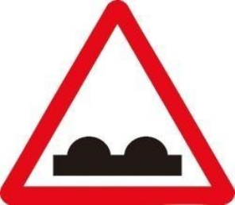
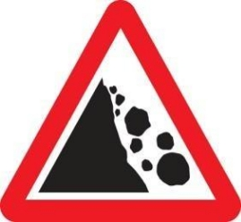

**IBYAPA BIBURIRA**

**Icyapa kiburirako imbere hari ikoni ry'ibumoso**

**icyapa kigaragaza amakona abiri cyangwa arenga iryambere riri ibumo**

`                     `**umuhanda umanuka cyane**

**umuhanda uterera cyane**

**Ifungana ry'umuhanda. Ikicyapa gisobanura umuhanda ugenda ugabanuka mu bugari .**

**Ifungana ry'umuhanda ibumoso. Umuhanda uragenda ubamuto kuruhande rw'ibumoso**

**Ifungana ry'umuhanda iburyo. Umuhanda uragenda ubamuto kuruhande rw'iburyo**

**Uguhinguka kumwaro cyangwa inkombe. Icyapa kiburira ko umuhanda wegereye inkombe y'uruzi cyangwa ikiyaga**

**Umuhanda utaringaniye. Gisaba kugabanya umuvuduko kubera utugunguzi(dos d'ane) turi imbere. Akenshi bagishyira ahantu hamanuka cyane.**

**Umuhanda unyerera cyane**

**Amabuye ahanuka. Ikicyapa gisaba umuyobozi kwitondera ibintu nk'amabuye bishobora guhanuka muri akogace agezemo**

- **Akayira k'abanyamaguru.Icyapa gisab kwitondera urujya n'uruza rw'abantu**

**Akayira k'abana. Iki cyapa kiburira umuyobozi ko imbere ye hari ishuri ko akwiye kugenda buhoro**

**Aho abanyamagare bahingukira. Icyapa kiburira ko hari ibinyamitende nk'amagare abiri ahohafi mu nzira.**

**Akayira k'amatungo. Icyapa kiburira ko hari amatungo ari aho hafi mu nzira cyangwa yambukiranya**

**Akayira k'inyamaswa. Icyapa kiburira ko hari inyamaswa ziri aho hafi mu nzira cyangwa zambukiranya**

**Icyapa kigaragaza imirimo y'ubwubatsi mu muhanda**

**Ikibuga k'indege. Icyapa kiburira ko akogace hari indege zigendera kubutumburuke bwohasi.**

**Umuyaga w'intambike. Icyapa gisobanura ko aho hantu harangwa n'umuyaga mwinshi.**

**Umuhanda ubisikanirwamo. Umuhanda banyuramo mu byerekezo byombi.**

**Inkomane: ugutambuka mbere kw'abaturutse iburyo.**

**Icyapa kerekana inkomane**

**Iki cyapa cyerekana ko imbere hari umuhanda**

**Umuhanda w’iyungira iburyo**

**icyapa cyo gusohoka umuhanda**

**Icyapa kerekana inkomane**

**icyapakerekanainkomane Y**

**Uruherekane rw'inkomane**

**Iki cyapa gisobanuye ko umuyobozi afite uburenganzira bwogukomeza gutwara kurusha imihanda yiyunga**

**Iki cyapa Cyerekana amasangano bangendamo bazengurutse. Mbese ninkarond-point mu gifaransa cg roundabout mu cyongerez**

**Icyapa kiburira kwitondera gariyamoshi.**

**Iki cyapa gisobanura ahegereye icyago kidasobanuye**

**ukundi.**

**Iki cyapa cyerekana icyago kidahoraho kandi cyerekana aho bayobereza umuhanda igihe usanywa cg hari**
