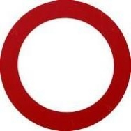
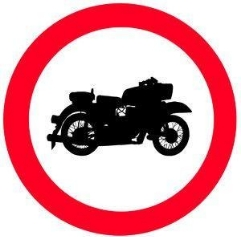
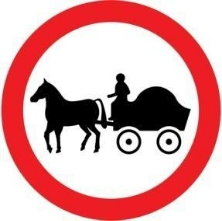
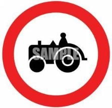
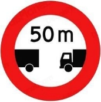
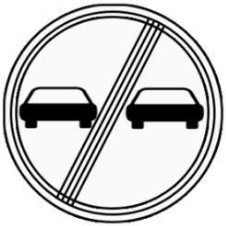

**IBYAPA BITEGEKA**

**Ntihanyurw**

**Ntihanyurwa mu byerekezobyombi**

**Ntihanyurwa n'abandi uretse abahatuye**

**Ntihanyurwa n'imodoka n'amapikipiki afite akanyamizigo kuruhande**

**Ntihanyurwa n'amapikipiki**

**Ntihanyurwa n'ibinyabitende**

**Ntihanyurwa naza velomoteri**

**Ntihanyurwa n'ibinyabiziga bitwara ibicuruzwa**

**Ntihanyurwa n'ikinyabiziga gikurura**

`                 `**Ntihanyurwan'abanyamaguru**

**Ntihanyurwa n'ibikururwa**

**Ntihanyurwa n'udusunikwa**

**Ntihanyurwa n'ibinyabiziga bihinga**

**Ntihanyurwa n'amokomenshi y'ibinyabiziga**

**Ntihanyurwa n'ibirengeje metero 2 y'ubugari**

**Ntihanyurwa n'ibirengeje metero 3,5 z'uburebure.**

**Ntihanyurwa n'ibirengeje toni 5.**

**Ntihanyurwa n'ibirengeje toni 2**

**Ntihanyurwa n'ibikomatanye birenze metero**

**zerekanywe**

**Ibinyabiziga bitegetswe gusiga metero zerekanywe**

**hagati yabyo**

**Birabujijwe gukatira ibumoso**

**Birabujijwe gukatira iburyo**

**Birabujijwe guhindukira**

**Birabujijwe kunyuranaho**

**Birabujijwe kunyuranaho kubinyabiziga bitwaye ibintu**

**Umuvuduko ntarengwa ni 40km/h**

**Birabujijwe kuvuza amahoni keretse wirinda impanuka**

**Birabujijwe gutambuka udahagaze (bariyere, gasutamo)**

**Iherezo ryokubuzwa kurenza umuvuduko**

**werekanywe**

**Iherezo ry'ibyari bibujijwe byose**

**Iherezo ryokubuza kunyuranaho**

**Birabujijwe guhagarara umwanya munini.**

**Birabujijweguhagararaumwanyamuninin'umuto**

**Birabujijwe guhagarara mu mwanya kuminsi yerekanywe kucyapa**
